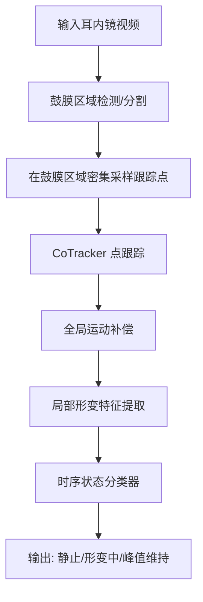
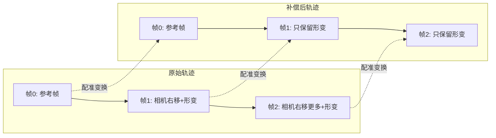
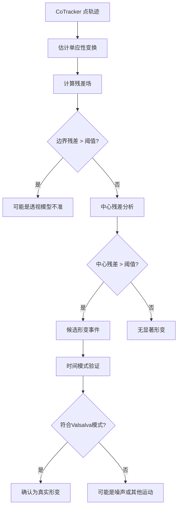
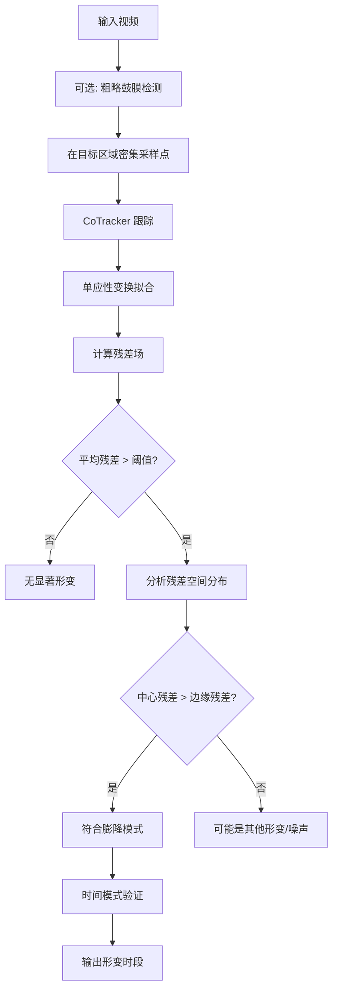
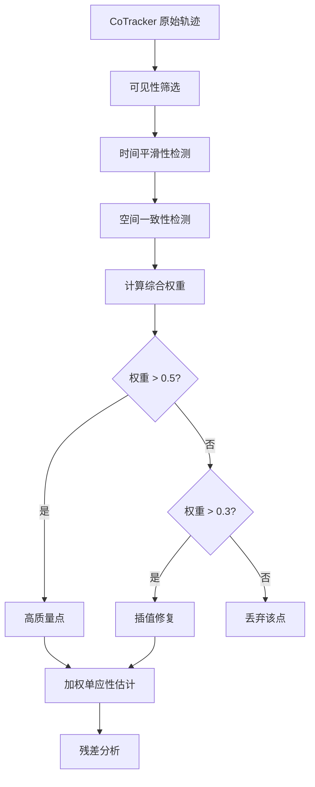

# Chat Conversation

Note: _This is purely the output of the chat conversation and does not contain any raw data, codebase snippets, etc. used to generate the output._

### User Input


你是一名擅长计算机视觉和医学影像的专家，熟悉视频分析、细微形变检测以及深度学习建模。现在有以下任务场景，请根据描述帮我设计合适的算法思路 / 模型框架 / 数据处理流程。

**场景描述：**

* 通过耳内镜录制一段鼓膜视频：

  * 一开始，鼓膜处于**初始静止状态**。
  * 做 Valsalva 动作时，鼓膜会**向外逐渐膨隆**，这种形变**幅度很小、持续时间很短**。
  * 当膨隆达到峰值后，鼓膜会在这个**峰值状态短暂维持不变**。

* 录制过程中，**摄像头和鼓膜之间可能存在晃动和视角变化**，导致：

  * 虽然鼓膜在物理空间里的**真实边界是固定的**，
  * 但在视频帧上的**鼓膜投影边界会因为内窥镜角度变化而发生位置和形状的变化**。

* 鼓膜膨隆时具有以下特点：

  * 变形是**局部的 3D 形变**，类似一层周边被固定的薄膜被气压吹起来，在图像中是 3D 形变投影到 2D。
  * **不一定是整个鼓膜同时变化**，可能只有部分区域发生明显形变。
  * 如果直接看**整块鼓膜区域的全局平均强度 / 特征**，细微的局部变化可能会被“平均掉”，导致信号淹没在噪声中。

**任务目标：**

* 构建一个**人工智能模型**，输入为耳内镜视频，输出为：

  * 自动检测并标记视频中**“鼓膜正在发生形变 / 膨隆”**的时间段或帧；
  * 能区分：

    1. 初始静止状态
    2. 正在膨隆或回落、存在形变的阶段
    3. 膨隆峰值且维持不变的阶段（如果需要，可以与静止初始状态区分）

**关键挑战：**

1. **形变幅度小**：鼓膜的真实形变很细微。
2. **形变局部化**：只有鼓膜的一部分区域可能发生变化，全局平均会掩盖这种局部信号。
3. **相机晃动 / 视角变化**：相机和鼓膜的相对位置不稳定，导致鼓膜边缘和纹理在 2D 投影中移动或变形，需要与真实鼓膜形变区分开。
4. **三维到二维投影问题**：本质上是 3D 膜结构形变在 2D 图像中的投影变化，需要模型更关注“形状 / 纹理的局部时空变化”，而不是单帧亮度变化。

**我想利用cotracker这个模型来完成这个任务**

**请你：**

**评估利用cotracker完成这个任务是否合理，可能会有什么坑**
**适合这一任务的**总体方法思路**
* **是否需要处理相机晃动和配准问题**，比如：
  * 是否需要对鼓膜区域进行分割和对齐；
  * 是否使用局部 patch、网格分块、特征点跟踪来减少全局运动的影响。
* **如何设计“局部变化敏感”的特征或模型结构**，避免简单全局平均导致信号被抹平。
* 推荐的**数据标注方式**（例如标注变化开始/结束的帧、关键帧对、变化强度等级等）和**训练策略**。
* 如果可以，请给出一个**从数据预处理 →模型架构 → 训练目标 → 推理阶段**的完整流程示意。


### Planner Response

这是一个非常有趣且具有挑战性的医学影像分析任务！在给出详细建议之前，让我先看看你工作空间中的 CoTracker 项目结构，以便更好地结合你现有的代码基础来提供建议。

*Listed directory [co-tracker](file:///d:/co-tracker) *

*Viewed [README.md](file:///d:/co-tracker/README.md) *

*Listed directory [cotracker](file:///d:/co-tracker/cotracker) *

### Planner Response

现在我对 CoTracker 有了更好的了解。让我给你一个 **全面的技术分析和解决方案**：

---

# 🎯 使用 CoTracker 进行鼓膜形变检测的可行性分析与完整方案

## 一、CoTracker 用于本任务的评估

### ✅ **CoTracker 的优势 — 非常适合本任务**

| 特性 | 对本任务的意义 |
|------|----------------|
| **密集点跟踪** | 可以在鼓膜上采样数百个点，捕捉**局部细微形变** |
| **时空联合建模** | Transformer 架构同时考虑空间和时间，天然适合检测**渐进式微小变化** |
| **点协同跟踪** | 多点一起跟踪可区分**全局运动（相机晃动）** vs **局部形变（鼓膜膨隆）** |
| **可见性预测** | `pred_visibility` 输出帮助识别遮挡或不可靠区域 |
| **Online 模式** | 支持流式处理，适合实时检测 |

### ⚠️ **潜在的坑与挑战**

| 挑战 | 具体问题 | 解决方案 |
|------|----------|----------|
| **形变太小** | 鼓膜膨隆可能只有几个像素，接近跟踪噪声 | 需要后处理滤波 + 基于形变模式的分类器 |
| **2D 投影歧义** | 纯水平/垂直的 2D 位移无法区分相机平移 vs 形变 | 分析点群的**相对位移模式**（相机运动导致一致平移，形变导致径向散开） |
| **鼓膜边界不固定** | 内窥镜画面中鼓膜可能只占部分区域 | 需要先做**鼓膜分割/检测** |
| **反光/高光** | 内窥镜照明产生高光区域，导致点跟踪失败 | 在高光区域避免采样，使用可见性 mask |
| **帧率问题** | 形变持续时间短，低帧率可能漏帧 | 确保 ≥30fps 的视频采集 |

---

## 二、总体方法思路



---

## 三、详细流程设计

### **阶段 1: 数据预处理**

```python
# 伪代码流程
def preprocess_pipeline(video_path):
    # 1. 加载视频
    frames = load_video(video_path)  # T x H x W x 3
    
    # 2. 鼓膜区域分割 (使用预训练分割模型或简单圆形检测)
    # 鼓膜通常呈椭圆形，边界明显
    tympanic_masks = segment_tympanic_membrane(frames)
    
    # 3. 在鼓膜区域内采样网格点
    # 避开高光区域
    query_points = sample_grid_on_mask(
        mask=tympanic_masks[0],
        grid_size=20,  # 20x20 的点网格
        avoid_highlights=True
    )
    
    return frames, tympanic_masks, query_points
```

> [!TIP]
> **鼓膜分割方案选择**:
> - 简单方案: 霍夫圆检测 + 颜色阈值
> - 中等方案: 预训练 SAM (Segment Anything) 配合点提示
> - 复杂方案: 训练专用的 U-Net 分割模型

### **阶段 2: CoTracker 点跟踪**

```python
import torch

def run_cotracker(video_tensor, query_points):
    """
    video_tensor: [1, T, C, H, W]
    query_points: [1, N, 3]  (frame_idx, x, y)
    """
    device = 'cuda'
    cotracker = torch.hub.load("facebookresearch/co-tracker", "cotracker3_offline").to(device)
    
    # 跟踪所有点
    pred_tracks, pred_visibility = cotracker(
        video_tensor.to(device),
        queries=query_points.to(device)
    )
    # pred_tracks: [1, T, N, 2] - 每帧每个点的 (x, y) 坐标
    # pred_visibility: [1, T, N, 1] - 每个点的可见性置信度
    
    return pred_tracks, pred_visibility
```

### **阶段 3: 全局运动补偿（关键！）**

这是区分 **相机晃动** 和 **真实形变** 的核心步骤：

```python
import numpy as np
from scipy.spatial import procrustes

def compensate_global_motion(tracks, visibility, reference_frame=0):
    """
    使用 Procrustes 分析 或 仿射变换 去除全局运动
    
    核心思想: 
    - 相机运动 → 所有点一致性平移/旋转/缩放
    - 鼓膜形变 → 部分点相对于其他点发生位移
    """
    T, N = tracks.shape[1], tracks.shape[2]
    
    compensated_tracks = tracks.clone()
    reference_points = tracks[0, reference_frame]  # 参考帧的点位置
    
    for t in range(T):
        current_points = tracks[0, t]
        visible_mask = visibility[0, t, :, 0] > 0.5
        
        if visible_mask.sum() > 10:  # 至少有10个可见点
            # 估计仿射变换 (考虑平移、旋转、缩放)
            H = estimate_affine_transform(
                current_points[visible_mask],
                reference_points[visible_mask]
            )
            # 应用逆变换补偿全局运动
            compensated_tracks[0, t] = apply_affine(current_points, H)
    
    return compensated_tracks
```

> [!IMPORTANT]
> **全局运动补偿的另一种思路**: 
> 不直接补偿，而是计算**相对变形场**——每个点相对于其邻居点的位移。这样全局运动会被抵消，只保留局部形变信息。

### **阶段 4: 局部形变特征提取**

```python
def extract_deformation_features(compensated_tracks, grid_size=20):
    """
    设计对局部变化敏感的特征，而非全局平均
    """
    T, N = compensated_tracks.shape[1], compensated_tracks.shape[2]
    features = []
    
    for t in range(1, T):
        # 1. 点位移向量
        displacement = compensated_tracks[0, t] - compensated_tracks[0, t-1]  # [N, 2]
        
        # 2. 将位移重塑为空间网格
        disp_field = displacement.reshape(grid_size, grid_size, 2)
        
        # 3. 提取局部敏感特征
        feat_t = {
            # 散度: 正值表示向外膨胀（膨隆）
            'divergence': compute_divergence(disp_field),
            
            # 径向位移分量（相对于中心）
            'radial_displacement': compute_radial_component(displacement),
            
            # 位移幅度的空间方差（高方差 = 局部变化）
            'spatial_variance': displacement.norm(dim=-1).var(),
            
            # 最大局部位移（捕捉最强信号）
            'max_displacement': displacement.norm(dim=-1).max(),
            
            # 高位移区域占比
            'high_disp_ratio': (displacement.norm(dim=-1) > threshold).float().mean()
        }
        features.append(feat_t)
    
    return features
```

### **阶段 5: 时序状态分类器**

```python
import torch.nn as nn

class DeformationStateClassifier(nn.Module):
    """
    三分类: 静止(0) / 形变中(1) / 峰值维持(2)
    """
    def __init__(self, feature_dim=5, hidden_dim=64, num_classes=3):
        super().__init__()
        
        # 使用 1D CNN 或 LSTM 捕捉时序模式
        self.temporal_encoder = nn.LSTM(
            input_size=feature_dim,
            hidden_size=hidden_dim,
            num_layers=2,
            bidirectional=True,
            batch_first=True
        )
        
        self.classifier = nn.Sequential(
            nn.Linear(hidden_dim * 2, 32),
            nn.ReLU(),
            nn.Linear(32, num_classes)
        )
    
    def forward(self, features):
        """
        features: [B, T, feature_dim]
        output: [B, T, num_classes] 每帧的状态预测
        """
        temporal_feat, _ = self.temporal_encoder(features)
        logits = self.classifier(temporal_feat)
        return logits
```

> [!TIP]
> **为什么用时序模型而非逐帧分类？**
> - "形变中" 状态需要看到**变化趋势**（位移在增加）
> - "峰值维持" 需要看到**形变后稳定**（先有变化，后稳定）
> - 双向 LSTM 可以利用前后文信息

---

## 四、数据标注方案

### **推荐标注方式**

| 标注类型 | 内容 | 作用 |
|----------|------|------|
| **帧级状态标签** | 每帧标注 0/1/2 (静止/形变/峰值) | 训练分类器 |
| **关键帧标注** | 标记 变化开始帧 / 峰值到达帧 / 视频结束帧 | 可转化为逐帧标签 |
| **鼓膜 mask** | 第一帧标注轮廓即可（用于采样区域） | 预处理阶段 |

### **标注工具建议**

```
按时间顺序播放视频，标注:
- T_start: 形变开始帧
- T_peak: 达到峰值帧 
- T_end: 视频结束/形变回落帧

自动生成帧标签:
- [0, T_start): 静止 = 0
- [T_start, T_peak): 形变中 = 1
- [T_peak, T_end]: 峰值维持 = 2
```

---

## 五、训练策略

### **损失函数**

```python
def compute_loss(pred_logits, labels, weights=None):
    """
    加权交叉熵 + 时序平滑正则
    """
    # 类别不平衡处理（形变帧通常较少）
    class_weights = torch.tensor([1.0, 3.0, 2.0])  # 增加形变类权重
    
    ce_loss = F.cross_entropy(
        pred_logits.view(-1, 3), 
        labels.view(-1),
        weight=class_weights
    )
    
    # 时序平滑: 惩罚相邻帧预测跳变
    pred_probs = F.softmax(pred_logits, dim=-1)
    temporal_smoothness = (pred_probs[:, 1:] - pred_probs[:, :-1]).pow(2).mean()
    
    return ce_loss + 0.1 * temporal_smoothness
```

### **数据增强**

```python
def augment_video(video, tracks):
    # 1. 随机裁剪/缩放 (模拟不同距离)
    # 2. 轻微旋转 (模拟相机角度变化)  
    # 3. 亮度/对比度变化 (模拟不同光照)
    # 4. 时序抖动: 随机丢帧/重复帧
    # 5. 添加相机晃动: 对所有点施加一致的随机位移
    pass
```

---

## 六、推理阶段流程

```python
def inference(video_path):
    # 1. 预处理
    video, masks, query_points = preprocess_pipeline(video_path)
    
    # 2. CoTracker 跟踪
    with torch.no_grad():
        video_tensor = torch.from_numpy(video).permute(0, 3, 1, 2)[None].float()
        tracks, visibility = run_cotracker(video_tensor, query_points)
    
    # 3. 全局运动补偿
    compensated_tracks = compensate_global_motion(tracks, visibility)
    
    # 4. 特征提取
    features = extract_deformation_features(compensated_tracks)
    features_tensor = torch.stack([
        torch.tensor([f['divergence'], f['radial_displacement'], 
                     f['spatial_variance'], f['max_displacement'],
                     f['high_disp_ratio']])
        for f in features
    ])[None]  # [1, T-1, 5]
    
    # 5. 状态分类
    classifier = load_trained_classifier()
    with torch.no_grad():
        logits = classifier(features_tensor)
        predictions = logits.argmax(dim=-1)  # [1, T-1]
    
    # 6. 后处理: 时序滤波 + 状态合并
    final_states = temporal_smooth(predictions)
    
    return {
        'frame_states': final_states,
        'deformation_start': find_transition(final_states, from_state=0, to_state=1),
        'peak_reached': find_transition(final_states, from_state=1, to_state=2)
    }
```

---

## 七、关键设计决策总结

| 问题 | 推荐方案 | 理由 |
|------|----------|------|
| **相机运动补偿** | 仿射配准 + 残差分析 | 区分全局运动和局部形变 |
| **局部敏感特征** | 散度场 + 径向位移 + 空间方差 | 鼓膜膨隆是"径向向外"的模式 |
| **避免全局平均** | 保留空间网格结构，使用 max/variance 统计量 | 局部信号不被稀释 |
| **时序建模** | 双向 LSTM 或 1D TCN | 利用上下文判断状态转换 |
| **类别不平衡** | 加权损失 + 采样策略 | 形变帧可能占少数 |

---

## 八、潜在改进方向

1. **多尺度跟踪**: 不同密度的网格点，同时捕捉大范围运动和精细形变
2. **注意力机制**: 让模型自动学习关注哪些区域的形变
3. **对比学习预训练**: 用 静止帧对 vs 形变帧对 做自监督学习
4. **利用 3D 信息**: 如果可以获取深度信息，可以直接重建 3D 表面变化

---

**需要我进一步细化某个环节，或者帮你写一个初步的代码框架吗？** 比如：
1. 完整的推理脚本
2. 数据预处理模块
3. 可视化形变场的工具

### User Input

1 你准备如何完成全局运动补偿？
2 [!IMPORTANT] 全局运动补偿的另一种思路: 不直接补偿，而是计算相对变形场——每个点相对于其邻居点的位移。这样全局运动会被抵消，只保留局部形变信息。帮我详细解释这一点

### User Input

Continue

### Planner Response

# 全局运动补偿详解

## 一、方案1: 显式配准补偿

### 核心思想

将每帧的跟踪点变换回"参考帧"的坐标系，消除相机运动带来的全局偏移。



### 实现代码

```python
import numpy as np
import cv2
from typing import Tuple

def estimate_rigid_transform(src_points: np.ndarray, 
                              dst_points: np.ndarray,
                              weights: np.ndarray = None) -> np.ndarray:
    """
    估计刚性变换 (旋转 + 平移), 将 src_points 对齐到 dst_points
    使用加权最小二乘法
    
    Args:
        src_points: [N, 2] 源点坐标
        dst_points: [N, 2] 目标点坐标  
        weights: [N] 每个点的权重(可见性)
        
    Returns:
        H: [2, 3] 仿射变换矩阵
    """
    if weights is None:
        weights = np.ones(len(src_points))
    
    # 加权质心
    w_sum = weights.sum()
    src_centroid = (src_points * weights[:, None]).sum(axis=0) / w_sum
    dst_centroid = (dst_points * weights[:, None]).sum(axis=0) / w_sum
    
    # 去中心化
    src_centered = src_points - src_centroid
    dst_centered = dst_points - dst_centroid
    
    # 加权协方差矩阵
    H = (src_centered * weights[:, None]).T @ dst_centered
    
    # SVD 求最优旋转
    U, S, Vt = np.linalg.svd(H)
    R = Vt.T @ U.T
    
    # 处理反射情况
    if np.linalg.det(R) < 0:
        Vt[-1, :] *= -1
        R = Vt.T @ U.T
    
    # 计算平移
    t = dst_centroid - R @ src_centroid
    
    # 组装变换矩阵
    transform = np.eye(3)
    transform[:2, :2] = R
    transform[:2, 2] = t
    
    return transform[:2, :]


def estimate_affine_transform(src_points: np.ndarray,
                               dst_points: np.ndarray,
                               weights: np.ndarray = None) -> np.ndarray:
    """
    估计仿射变换 (旋转 + 平移 + 缩放 + 剪切)
    使用 RANSAC 增强鲁棒性
    """
    if weights is not None:
        # 根据权重筛选可靠点
        reliable_mask = weights > 0.5
        src_points = src_points[reliable_mask]
        dst_points = dst_points[reliable_mask]
    
    if len(src_points) < 4:
        return np.eye(2, 3)
    
    # 使用 OpenCV 的 RANSAC 仿射估计
    H, inliers = cv2.estimateAffinePartial2D(
        src_points.astype(np.float32),
        dst_points.astype(np.float32),
        method=cv2.RANSAC,
        ransacReprojThreshold=3.0
    )
    
    return H if H is not None else np.eye(2, 3)


def compensate_global_motion_

### User Input

Continue

### User Input

Continue

### Planner Response

继续完整的全局运动补偿代码和第二种方案的详细解释：

---

## 方案1 续: 完整的显式配准补偿

```python
def compensate_global_motion_explicit(tracks: np.ndarray, 
                                       visibility: np.ndarray,
                                       reference_frame: int = 0) -> Tuple[np.ndarray, np.ndarray]:
    """
    显式全局运动补偿
    
    Args:
        tracks: [T, N, 2] 原始轨迹
        visibility: [T, N] 可见性权重
        reference_frame: 参考帧索引
        
    Returns:
        compensated_tracks: [T, N, 2] 补偿后轨迹
        residuals: [T, N, 2] 残差(局部形变)
    """
    T, N = tracks.shape[:2]
    compensated_tracks = np.zeros_like(tracks)
    transforms = []  # 保存每帧的变换矩阵
    
    ref_points = tracks[reference_frame]  # 参考帧的点位置
    
    for t in range(T):
        current_points = tracks[t]
        weights = visibility[t]
        
        # 估计当前帧到参考帧的变换
        H = estimate_affine_transform(
            src_points=current_points,
            dst_points=ref_points,
            weights=weights
        )
        transforms.append(H)
        
        # 应用变换，将当前帧的点"拉回"参考帧坐标系
        ones = np.ones((N, 1))
        current_homo = np.hstack([current_points, ones])  # [N, 3]
        compensated_tracks[t] = (H @ current_homo.T).T  # [N, 2]
    
    # 残差 = 补偿后位置 - 参考帧位置
    # 这就是去除全局运动后的"纯局部形变"
    residuals = compensated_tracks - ref_points[None, :, :]
    
    return compensated_tracks, residuals
```

### 可视化验证

```python
import matplotlib.pyplot as plt

def visualize_compensation(original_tracks, compensated_tracks, frame_idx):
    """可视化补偿效果"""
    fig, axes = plt.subplots(1, 2, figsize=(12, 5))
    
    # 原始轨迹: 包含全局运动
    ax = axes[0]
    for n in range(original_tracks.shape[1]):
        ax.plot(original_tracks[:, n, 0], original_tracks[:, n, 1], 'b-', alpha=0.3)
    ax.scatter(original_tracks[frame_idx, :, 0], original_tracks[frame_idx, :, 1], c='r', s=20)
    ax.set_title("原始轨迹 (含相机运动)")
    ax.set_aspect('equal')
    
    # 补偿后: 只有局部形变
    ax = axes[1]
    for n in range(compensated_tracks.shape[1]):
        ax.plot(compensated_tracks[:, n, 0], compensated_tracks[:, n, 1], 'g-', alpha=0.3)
    ax.scatter(compensated_tracks[frame_idx, :, 0], compensated_tracks[frame_idx, :, 1], c='r', s=20)
    ax.set_title("补偿后轨迹 (只保留形变)")
    ax.set_aspect('equal')
    
    plt.tight_layout()
    plt.show()
```

---

## 方案2: 相对变形场 (Relative Deformation Field)

### 核心思想

> **不需要显式估计全局变换**，而是计算每个点**相对于其邻居**的位移差异。

直觉解释：
- 🎥 **相机平移**: 所有点向同一方向移动相同距离 → 邻居之间相对位移 = 0
- 🎈 **鼓膜膨隆**: 不同区域的点向外扩散程度不同 → 邻居之间相对位移 ≠ 0

```
┌────────────────────────────────────────────────────────────┐
│                                                            │
│    相机右移 2px:                局部膨隆:                   │
│                                                            │
│    ● → ●  ● → ●  ● → ●          ●    ●↗   ●               │
│                                      ↗                     │
│    ● → ●  ● → ●  ● → ●          ● ← ●    ●→               │
│                                     ↘                      │
│    ● → ●  ● → ●  ● → ●          ●   ●↘   ●                │
│                                                            │
│    所有点移动一致               中心区域向外发散            │
│    相对位移 ≈ 0                 相对位移 显著               │
│                                                            │
└────────────────────────────────────────────────────────────┘
```

### 数学定义

对于点 $p_i$ 在帧 $t$ 的位移 $\mathbf{d}_i^t = \mathbf{p}_i^t - \mathbf{p}_i^{t-1}$

**相对变形场**定义为：

$$\mathbf{r}_i^t = \mathbf{d}_i^t - \frac{1}{|N(i)|} \sum_{j \in N(i)} \mathbf{d}_j^t$$

其中 $N(i)$ 是点 $i$ 的邻居集合。

### 详细实现

```python
import numpy as np
from scipy.spatial import Delaunay, KDTree
from typing import List, Optional

class RelativeDeformationField:
    """
    相对变形场计算器
    """
    
    def __init__(self, 
                 neighbor_type: str = "knn",  # "knn" 或 "delaunay" 或 "grid"
                 k_neighbors: int = 8,
                 grid_shape: Optional[Tuple[int, int]] = None):
        """
        Args:
            neighbor_type: 邻居定义方式
                - "knn": K近邻
                - "delaunay": Delaunay三角剖分的相邻点
                - "grid": 规则网格的4/8邻域
            k_neighbors: KNN时的K值
            grid_shape: 网格形状 (rows, cols), 仅grid模式需要
        """
        self.neighbor_type = neighbor_type
        self.k_neighbors = k_neighbors
        self.grid_shape = grid_shape
        self.neighbor_indices = None  # 缓存邻居索引
        
    def _build_knn_neighbors(self, points: np.ndarray) -> List[np.ndarray]:
        """基于空间距离的K近邻"""
        tree = KDTree(points)
        neighbors = []
        for i in range(len(points)):
            # 查询K+1个邻居(包括自己)，排除自己
            _, indices = tree.query(points[i], k=self.k_neighbors + 1)
            neighbors.append(indices[1:])  # 排除自己
        return neighbors
    
    def _build_delaunay_neighbors(self, points: np.ndarray) -> List[np.ndarray]:
        """基于Delaunay三角剖分的拓扑邻居"""
        tri = Delaunay(points)
        neighbors = [set() for _ in range(len(points))]
        
        for simplex in tri.simplices:
            for i in range(3):
                for j in range(3):
                    if i != j:
                        neighbors[simplex[i]].add(simplex[j])
        
        return [np.array(list(n)) for n in neighbors]
    
    def _build_grid_neighbors(self, n_points: int) -> List[np.ndarray]:
        """规则网格的8邻域"""
        rows, cols = self.grid_shape
        neighbors = []
        
        for idx in range(n_points):
            r, c = idx // cols, idx % cols
            neighbor_list = []
            
            for dr in [-1, 0, 1]:
                for dc in [-1, 0, 1]:
                    if dr == 0 and dc == 0:
                        continue
                    nr, nc = r + dr, c + dc
                    if 0 <= nr < rows and 0 <= nc < cols:
                        neighbor_list.append(nr * cols + nc)
            
            neighbors.append(np.array(neighbor_list))
        
        return neighbors
    
    def build_neighbors(self, reference_points: np.ndarray):
        """
        基于参考帧的点位置构建邻居关系
        只需调用一次，后续帧复用
        """
        n_points = len(reference_points)
        
        if self.neighbor_type == "knn":
            self.neighbor_indices = self._build_knn_neighbors(reference_points)
        elif self.neighbor_type == "delaunay":
            self.neighbor_indices = self._build_delaunay_neighbors(reference_points)
        elif self.neighbor_type == "grid":
            assert self.grid_shape is not None
            self.neighbor_indices = self._build_grid_neighbors(n_points)
        else:
            raise ValueError(f"Unknown neighbor type: {self.neighbor_type}")
        
        print(f"Built {self.neighbor_type} neighbors, avg degree: "
              f"{np.mean([len(n) for n in self.neighbor_indices]):.1f}")
    
    def compute(self, 
                displacements: np.ndarray, 
                visibility: Optional[np.ndarray] = None) -> np.ndarray:
        """
        计算相对变形场
        
        Args:
            displacements: [N, 2] 每个点的原始位移
            visibility: [N] 可见性权重，用于加权邻居平均
            
        Returns:
            relative_deformation: [N, 2] 相对位移
        """
        if self.neighbor_indices is None:
            raise RuntimeError("Please call build_neighbors() first")
        
        N = len(displacements)
        relative_def = np.zeros((N, 2))
        
        for i in range(N):
            neighbors = self.neighbor_indices[i]
            
            if len(neighbors) == 0:
                relative_def[i] = displacements[i]
                continue
            
            if visibility is not None:
                # 加权平均，可见性高的邻居权重大
                weights = visibility[neighbors]
                if weights.sum() > 0:
                    neighbor_mean = np.average(
                        displacements[neighbors], 
                        axis=0, 
                        weights=weights
                    )
                else:
                    neighbor_mean = displacements[neighbors].mean(axis=0)
            else:
                neighbor_mean = displacements[neighbors].mean(axis=0)
            
            # 相对位移 = 自身位移 - 邻居平均位移
            relative_def[i] = displacements[i] - neighbor_mean
        
        return relative_def


def compute_relative_deformation_features(tracks: np.ndarray,
                                          visibility: np.ndarray,
                                          grid_shape: Tuple[int, int] = (20, 20)) -> dict:
    """
    基于相对变形场提取特征
    
    Args:
        tracks: [T, N, 2] 点轨迹
        visibility: [T, N] 可见性
        grid_shape: 采样网格形状
        
    Returns:
        features: 每帧的特征字典
    """
    T, N = tracks.shape[:2]
    
    # 初始化相对变形场计算器
    rdf = RelativeDeformationField(
        neighbor_type="grid",
        grid_shape=grid_shape
    )
    rdf.build_neighbors(tracks[0])  # 基于第一帧构建邻居关系
    
    frame_features = []
    
    for t in range(1, T):
        # 原始位移
        displacement = tracks[t] - tracks[t-1]  # [N, 2]
        
        # 计算相对变形场
        relative_def = rdf.compute(displacement, visibility[t])  # [N, 2]
        
        # 相对位移的幅度
        rel_magnitude = np.linalg.norm(relative_def, axis=1)  # [N]
        
        # 提取特征
        features = {
            # 平均相对变形幅度 (低 = 纯全局运动, 高 = 有局部形变)
            'mean_relative_mag': rel_magnitude.mean(),
            
            # 最大相对变形 (捕捉最强的局部形变)
            'max_relative_mag': rel_magnitude.max(),
            
            # 相对变形的标准差 (形变不均匀程度)
            'std_relative_mag': rel_magnitude.std(),
            
            # 高相对变形的点占比 (形变区域大小)
            'high_rel_ratio': (rel_magnitude > np.median(rel_magnitude) * 2).mean(),
            
            # 散度指标: 重新整形为网格，计算发散程度
            'divergence': self._compute_divergence(relative_def, grid_shape),
            
            # 原始相对变形场，供后续分析
            'relative_field': relative_def.reshape(*grid_shape, 2)
        }
        
        frame_features.append(features)
    
    return frame_features


def _compute_divergence(relative_def: np.ndarray, 
                        grid_shape: Tuple[int, int]) -> float:
    """
    计算散度: 正值表示向外膨胀，负值表示向内收缩
    """
    rows, cols = grid_shape
    field = relative_def.reshape(rows, cols, 2)
    
    # 计算 ∂u/∂x + ∂v/∂y
    du_dx = np.gradient(field[:, :, 0], axis=1)
    dv_dy = np.gradient(field[:, :, 1], axis=0)
    
    divergence = du_dx + dv_dy
    
    return divergence.mean()
```

---

## 两种方案对比

| 维度 | 方案1: 显式配准 | 方案2: 相对变形场 |
|------|----------------|------------------|
| **原理** | 估计全局变换 → 逆变换补偿 | 计算相邻点位移差异 |
| **优点** | 物理意义明确，可恢复相机轨迹 | 无需配准，实现简单，对outlier鲁棒 |
| **缺点** | 配准误差会累积；大形变时仿射模型不准 | 边界点邻居少，可能不稳定 |
| **适用场景** | 相机运动明显，需要显式补偿 | 关注局部形变检测，不关心全局运动 |
| **计算复杂度** | O(N) per frame | O(N × K) per frame |

---

## 用于鼓膜检测的推荐组合

```python
def extract_robust_deformation_features(tracks, visibility, grid_shape=(20, 20)):
    """
    结合两种方法的优势
    """
    T, N = tracks.shape[:2]
    
    # 方法1: 显式补偿，获取残差
    compensated, residuals = compensate_global_motion_explicit(tracks, visibility)
    
    # 方法2: 相对变形场
    rdf = RelativeDeformationField(neighbor_type="grid", grid_shape=grid_shape)
    rdf.build_neighbors(tracks[0])
    
    features = []
    for t in range(1, T):
        displacement = tracks[t] - tracks[t-1]
        
        # 相对变形
        rel_def = rdf.compute(displacement, visibility[t])
        rel_mag = np.linalg.norm(rel_def, axis=1)
        
        # 残差变形 (来自方法1)
        res_mag = np.linalg.norm(residuals[t], axis=1)
        
        feat = {
            # 融合两种方法的信号
            'combined_deformation': (rel_mag + res_mag).mean() / 2,
            
            # 两种方法的一致性 (高一致性 = 真实形变)
            'method_agreement': np.corrcoef(rel_mag, res_mag)[0, 1],
            
            # 其他特征...
            'max_relative_mag': rel_mag.max(),
            'spatial_pattern': rel_def.reshape(*grid_shape, 2)
        }
        features.append(feat)
    
    return features
```

---

## 可视化相对变形场

```python
import matplotlib.pyplot as plt
from matplotlib.colors import Normalize

def visualize_relative_deformation(relative_field: np.ndarray, 
                                   frame_idx: int,
                                   save_path: str = None):
    """
    可视化相对变形场
    
    Args:
        relative_field: [rows, cols, 2] 相对变形场
        frame_idx: 帧索引
    """
    rows, cols = relative_field.shape[:2]
    
    # 计算幅度
    magnitude = np.linalg.norm(relative_field, axis=-1)
    
    fig, axes = plt.subplots(1, 3, figsize=(15, 5))
    
    # 1. 幅度热力图
    ax = axes[0]
    im = ax.imshow(magnitude, cmap='hot', origin='lower')
    plt.colorbar(im, ax=ax)
    ax.set_title(f'Frame {frame_idx}: 相对变形幅度')
    
    # 2. 矢量场
    ax = axes[1]
    y, x = np.mgrid[0:rows, 0:cols]
    ax.quiver(x, y, 
              relative_field[:, :, 0], 
              relative_field[:, :, 1],
              magnitude, cmap='coolwarm', scale=20)
    ax.set_title('相对变形矢量场')
    ax.set_aspect('equal')
    ax.invert_yaxis()
    
    # 3. 散度图
    ax = axes[2]
    du_dx = np.gradient(relative_field[:, :, 0], axis=1)
    dv_dy = np.gradient(relative_field[:, :, 1], axis=0)
    divergence = du_dx + dv_dy
    
    im = ax.imshow(divergence, cmap='RdBu_r', origin='lower',
                   norm=Normalize(vmin=-0.5, vmax=0.5))
    plt.colorbar(im, ax=ax)
    ax.set_title('散度 (红=膨胀, 蓝=收缩)')
    
    plt.tight_layout()
    
    if save_path:
        plt.savefig(save_path, dpi=150)
    plt.show()
```

---

## 关键点总结

> [!TIP]
> **为什么相对变形场方法适合鼓膜检测？**
> 
> 1. **自动消除全局运动**：不需要显式估计相机变换，邻居差分天然抵消一致性运动
> 2. **局部敏感**：即使只有小区域膨隆，该区域的相对位移也会显著
> 3. **物理意义对应**：鼓膜膨隆产生的径向发散模式，在相对变形场中表现为正散度

> [!WARNING]  
> **注意事项**：
> - 邻居选择很重要：太少会噪声大，太多会过度平滑
> - 边界点处理：边界邻居不完整，可能需要特殊处理或直接排除
> - 跟踪点密度：太稀疏会漏掉局部形变，建议至少 15×15 网格

---

需要我帮你进一步实现完整的处理流程代码，或者针对某个具体环节深入讲解吗？

### User Input

鼓膜不是像一面垂直的墙壁那样挂在耳道的尽头，而是一个倾斜的、漏斗状的半透明膜。

这种倾斜的解剖结构对于理解耳科检查（如使用耳镜）所看到的景象以及声音的传导机制非常重要。

解剖学事实速览
倾斜方向： 鼓膜的朝向是 向外、向下、向前 的。反过来说，它的上部和后部比下部和前部更靠近耳道口。

关键夹角：

与耳道底壁（下壁）： 鼓膜与外耳道底壁之间形成一个锐角，大约为 45° - 55°。

与耳道前壁： 鼓膜与外耳道前壁之间也形成一个锐角。

结果： 这种倾斜导致外耳道的前下壁比后上壁更长。在做耳镜检查时，医生看到的光锥（反光点）通常位于前下象限，因为那里是鼓膜最“深”和最凹陷的地方。

鼓膜与外耳道夹角示意图
为了直观地说明这一点，我画了一个沿外耳道纵轴切开的剖面示意图。

（注：此图为模式图，为了强调倾斜角度，对外耳道的弯曲度做了一定简化）

这是鼓膜和外耳道的解剖事实，我有一个疑问，鼓膜没有产生变化，只是内窥镜的移动（拉近拉远、平移、旋转、倾斜）会产生类似你说的“相对变形场”吗？

### Planner Response

这是一个**非常关键的问题**！你指出的解剖学事实确实揭示了一个严重的技术挑战。让我详细分析：

---

# 🔬 内窥镜运动 vs 真实形变：深度分析

## 问题的本质

由于鼓膜是一个 **倾斜的3D表面**（~55°），而我们观察的是它的 **2D投影**，内窥镜的某些运动会产生 **非均匀的2D位移**，这与真实形变在"相对变形场"上可能难以区分。

---

## 各种内窥镜运动的分析

### 1️⃣ **纯平移（垂直于光轴）**
```
内窥镜左右/上下平移
```
- **效果**: 所有跟踪点在2D图像中**一致移动**
- **相对变形场**: ≈ 0 ✅
- **结论**: 可以被正确补偿，不会误判为形变

---

### 2️⃣ **绕光轴旋转**
```
内窥镜原地旋转
```
- **效果**: 所有点绕图像中心旋转
- **相对变形场**: ≈ 0 ✅（邻居点同步旋转）
- **结论**: 可以被正确补偿

---

### 3️⃣ ⚠️ **沿光轴移动（拉近/拉远）— 关键问题！**

这是最大的挑战。让我用图示说明：

```
侧视图（你提供的解剖图视角）:
                    
    内窥镜 ●───────────────▶ 光轴
              \  观察方向   
               \
                \         A点（上后部，离镜头近）
                 \       /
                  \     /  鼓膜
                   \   /   ~55°
                    \ /
                     B点（下前部，离镜头远）
```

**拉近时：**
- A点（近）: 放大倍数变化 **大** → 2D位移 **大**
- B点（远）: 放大倍数变化 **小** → 2D位移 **小**

**结果：不同区域的2D位移不一致！**

```python
# 简化的透视投影模型
# 内窥镜沿光轴移动 Δz 时，点 P 的2D位移：
#
# 原始投影: x_2d = f * X / Z
# 移动后:   x_2d' = f * X / (Z - Δz)
# 
# 位移: Δx = f * X * Δz / (Z * (Z - Δz))
#
# 关键：位移与 1/Z 成正比，离镜头越近，位移越大
```

**相对变形场分析：**
- 近处点（上后部）向外移动多 → 形成 **径向发散** 模式
- 远处点（下前部）移动少
- 这在相对变形场中表现为 **正散度**！

> [!CAUTION]
> **这与鼓膜真实膨隆的信号模式几乎一样！**
> 鼓膜向外膨隆时，中心区域也会产生径向发散。

---

### 4️⃣ ⚠️ **内窥镜倾斜（光轴方向改变）**

```
倾斜前:    倾斜后:
   ●           ●
   │            \
   │             \
   ▼              ▼
 ──────        ──────
 鼓膜          鼓膜
```

- **效果**: 透视变换改变，鼓膜的2D投影形状变化
- **相对变形场**: 非均匀，类似仿射/透视形变
- **可能与形变混淆**: 是的，特别是小角度倾斜

---

## 真实形变 vs 相机运动的关键区别

尽管存在上述挑战，真实形变和相机运动之间还是有一些**可区分的特征**：

### 特征对比表

| 特征 | 鼓膜真实膨隆 | 内窥镜拉近 | 内窥镜倾斜 |
|------|-------------|-----------|-----------|
| **变形中心** | 鼓膜的物理中心（锤骨脐附近） | 图像光学中心 | 旋转中心在图像外 |
| **变形场对称性** | 不一定对称，取决于膜的物理特性 | 相对于光心对称 | 非对称，有明显方向性 |
| **边界行为** | 边界固定（鼓膜环附近位移≈0） | 边界点也有位移 | 边界点也有位移 |
| **时间特性** | 与生理动作（Valsalva）同步 | 可能突然/持续/随机 | 可能突然/持续/随机 |
| **深度一致性** | 真正的3D凸起 | 仅是缩放效应 | 透视变化 |

---

## 解决方案

### 方案1: **利用边界约束**

> **鼓膜的物理边界（鼓膜环）是固定的，真实形变时边界点不会移动**

```python
def detect_true_deformation_with_boundary(tracks, visibility, grid_shape):
    """
    利用边界约束区分真实形变和相机运动
    """
    rows, cols = grid_shape
    
    # 定义边界点（网格边缘）和内部点
    boundary_mask = get_boundary_mask(rows, cols)
    interior_mask = ~boundary_mask
    
    for t in range(1, T):
        displacement = tracks[t] - tracks[t-1]
        
        # 分别计算边界和内部的位移
        boundary_disp = displacement[boundary_mask].mean(axis=0)
        interior_disp = displacement[interior_mask]
        
        # 如果边界点移动显著 → 主要是相机运动
        boundary_motion = np.linalg.norm(boundary_disp)
        
        # 真实形变信号 = 内部点相对于边界的额外位移
        relative_to_boundary = interior_disp - boundary_disp
        true_deformation_signal = np.linalg.norm(relative_to_boundary, axis=1).mean()
        
        # 形变置信度
        if boundary_motion > threshold:
            # 边界在动 → 主要是相机运动
            confidence = true_deformation_signal / (boundary_motion + eps)
        else:
            # 边界稳定 → 内部运动就是真实形变
            confidence = 1.0
```

---

### 方案2: **透视模型拟合与残差分析**

> **相机运动遵循透视几何规律，真实形变是对此的偏离**

```python
def fit_perspective_and_get_residual(src_points, dst_points, visibility):
    """
    拟合透视变换（8自由度），残差就是真实形变
    
    透视变换可以解释:
    - 平移 (2 DoF)
    - 旋转 (1 DoF)  
    - 缩放 (1 DoF) ← 拉近拉远
    - 剪切 (2 DoF)
    - 透视 (2 DoF) ← 倾斜
    """
    # 使用RANSAC估计单应性矩阵
    H, inliers = cv2.findHomography(
        src_points, dst_points, 
        cv2.RANSAC, 
        ransacReprojThreshold=2.0
    )
    
    # 用单应性变换预测目标位置
    src_homo = np.hstack([src_points, np.ones((len(src_points), 1))])
    predicted = (H @ src_homo.T).T
    predicted = predicted[:, :2] / predicted[:, 2:3]
    
    # 残差 = 实际位置 - 透视模型预测
    residual = dst_points - predicted
    
    return residual, H, inliers
```

**核心思想**:
- 单应性(Homography)变换可以完美描述**平面**在不同相机视角下的投影变化
- 如果鼓膜是静止平面，单应性变换应该能**完美解释**所有点的位移
- **残差**（实际位移 - 单应性预测）就是**真实形变信号**

```
残差大小分布:
- 相机运动（无形变）: 残差 ≈ 0 
- 鼓膜膨隆（有形变）: 中心区域残差显著
```

---

### 方案3: **利用时间特性**

```python
def analyze_temporal_pattern(deformation_signal, valsalva_timing):
    """
    真实形变与Valsalva动作时间高度相关
    """
    # 真实形变应该:
    # 1. 在Valsalva开始后才出现
    # 2. 渐进式增加（不是突然跳变）
    # 3. 达到峰值后稳定
    
    # 相机运动通常:
    # 1. 与Valsalva动作无时间关联
    # 2. 可能突然发生
    # 3. 持续时间不定
    
    # 计算信号的自相关和平滑度
    smoothness = compute_smoothness(deformation_signal)
    
    # 与预期的形变曲线模板匹配
    expected_pattern = generate_valsalva_template()  # 渐增-平稳模式
    correlation = np.correlate(deformation_signal, expected_pattern)
    
    return smoothness, correlation
```

---

### 方案4: **结合分割的精细分析**

如果能够精确分割出鼓膜区域，可以进行更精细的分析：

```python
def analyze_with_segmentation(video, tympanic_mask):
    """
    利用分割信息
    """
    # 1. 只在鼓膜区域内采样跟踪点
    # 2. 识别鼓膜边缘（鼓膜环）的跟踪点
    # 3. 利用边缘点约束估计相机运动
    # 4. 内部点相对于边缘的变化才是真实形变
    
    # 鼓膜上的解剖标志点（锤骨柄、光锥位置）
    # 这些在真实形变时位置相对稳定，可作为参考
    anatomical_landmarks = detect_landmarks(video)
```

---

## 推荐的综合方案



---

## 总结

你的担忧完全正确：

> **内窥镜沿光轴移动（拉近拉远）和倾斜会产生与真实形变相似的"相对变形场"信号**

解决方案的核心是：

| 方法 | 利用的先验知识 |
|------|---------------|
| 边界约束 | 鼓膜边缘（鼓膜环）在真实形变时保持固定 |
| 透视模型拟合 | 相机运动遵循透视几何，形变是残差 |
| 时间模式 | 真实形变与Valsalva动作时间相关 |
| 解剖学参考 | 锤骨柄等解剖标志可作为稳定参考 |

**最可靠的方案是：透视模型拟合 + 边界约束 + 时间模式验证 的组合**。

需要我进一步实现这个综合方案的代码吗？

### User Input

让我们先把有疑问的地方先搞清楚，然后修改方案，最后再生成代码。
边界约束要怎么做到呢？这样对鼓膜分割的要求是不是很高，要求在整个视频帧序列很高的一致性？

### User Input

Continue

### Planner Response

你说得非常对！让

### User Input

Continue

### Planner Response

你说得非常对！这是一个关键的实际问题。让我详细分析边界约束的不同实现方式及其对分割精度的要求：

---

# 边界约束的实现方式分析

## 问题剖析

你担忧的点非常准确：

| 挑战 | 具体问题 |
|------|----------|
| **分割精度要求** | 逐帧精确分割鼓膜边缘很困难 |
| **时序一致性** | 即使每帧分割正确，帧间边缘位置也会因相机运动而变化 |
| **混淆因素** | 分割边界的移动 vs 真实边界的移动 难以区分 |

---

## 方案对比

### ❌ 方案A: 逐帧分割 + 边界点跟踪 (你担心的方案)

```
帧1: 分割 → 提取边界点 → 跟踪
帧2: 分割 → 提取边界点 → 跟踪
...
问题: 分割不一致导致边界点"跳动"
```

**问题**:
- 需要每帧精确分割，成本高
- 分割边界不稳定会引入假信号
- 分割误差 ≈ 形变幅度时，无法区分

---

### ✅ 方案B: 第一帧分割 + 跟踪传播 (更实际)

```
帧1: 分割鼓膜区域 → 在区域内均匀采样所有跟踪点（含边界）
帧2-N: 只用 CoTracker 跟踪，不再分割
```

**优势**:
- 只需一帧高质量分割
- 边界点通过 **跟踪** 而非 **分割** 确定
- 跟踪的连续性比分割更好

**实现思路**:
```python
def setup_tracking_with_boundary(first_frame, tympanic_mask):
    """
    第一帧分割 + 采样策略
    """
    # 1. 在鼓膜区域内采样网格点
    interior_points = sample_grid_inside_mask(tympanic_mask, grid_size=15)
    
    # 2. 在鼓膜边缘采样边界点
    contour = extract_contour(tympanic_mask)
    boundary_points = sample_points_on_contour(contour, n_points=20)
    
    # 3. 合并
    all_points = np.vstack([interior_points, boundary_points])
    boundary_mask = np.array([False]*len(interior_points) + [True]*len(boundary_points))
    
    # 4. 用 CoTracker 跟踪所有点
    # 后续帧不需要再分割
    return all_points, boundary_mask
```

**关键假设**:
- CoTracker 能够可靠跟踪边界点
- 边界点在物理上是固定的（鼓膜环附着在骨性外耳道）

---

### ⚠️ 方案B的潜在问题

即使用跟踪代替分割，边界点的可靠性仍然是个问题：

| 问题 | 原因 | 影响 |
|------|------|------|
| 边界点跟踪失败 | 边缘纹理弱，容易漂移 | 边界约束不可靠 |
| 边界点被遮挡 | 耳垢、阴影、视角变化 | 部分边界点丢失 |
| 边界定义模糊 | 鼓膜环过渡区不清晰 | 初始采样就不准 |

---

## 更稳健的替代思路

### ✅ 方案C: 利用径向分布特性（无需精确边界）

核心思想：**不依赖"边界点"的精确定义，而是利用径向距离的统计规律**

```
鼓膜膨隆时:
- 中心区域位移大（向外凸起）
- 边缘区域位移小（被固定）
- 位移幅度随径向距离递减

内窥镜拉近时（透视效应）:
- 离镜头近的点位移大
- 离镜头远的点位移小
- 位移分布与"鼓膜中心"无关，而与"图像光心"相关
```

**区分方法**:
```python
def analyze_radial_distribution(displacement_field, grid_shape):
    """
    分析位移的径向分布
    """
    rows, cols = grid_shape
    
    # 定义两个中心
    # 1. 鼓膜几何中心（假设为网格中心）
    tympanic_center = (rows // 2, cols // 2)
    
    # 2. 图像光心位置
    optical_center = estimate_optical_center(displacement_field)  # 可从透视模型估计
    
    # 计算每个点到两个中心的距离
    for i in range(rows):
        for j in range(cols):
            r_tympanic = distance_to(i, j, tympanic_center)
            r_optical = distance_to(i, j, optical_center)
            displacement_mag = norm(displacement_field[i, j])
    
    # 分析:
    # 如果位移与 r_tympanic 负相关 → 真实形变（中心大，边缘小）
    # 如果位移与 r_optical 相关 → 相机运动（透视效应）
    
    corr_tympanic = compute_correlation(displacement_magnitudes, r_tympanic)
    corr_optical = compute_correlation(displacement_magnitudes, r_optical)
    
    return {
        'tympanic_correlation': corr_tympanic,  # 负值强 → 真实形变
        'optical_correlation': corr_optical,    # 正值强 → 相机运动
    }
```

**优势**:
- 不需要精确的边界分割
- 利用统计分布而非单点判断
- 对噪声更鲁棒

---

### ✅ 方案D: 透视模型拟合残差（最推荐）

这是我认为**最稳健**的方法，不依赖边界分割：

```
相机运动（无论平移、旋转、拉近、倾斜）
→ 可以用单应性变换（8参数）完美描述
→ 残差 ≈ 0

鼓膜形变
→ 是3D表面变化的投影
→ 不能用平面透视模型解释
→ 残差 ≠ 0（特别是中心区域）
```

```python
def detect_deformation_via_homography(tracks, visibility):
    """
    透视模型拟合 + 残差分析
    """
    T, N = tracks.shape[:2]
    ref_points = tracks[0]  # 参考帧
    
    deformation_signals = []
    
    for t in range(1, T):
        current_points = tracks[t]
        
        # 用 RANSAC 估计单应性变换
        H, inliers = cv2.findHomography(
            ref_points, current_points,
            cv2.RANSAC, 
            ransacReprojThreshold=2.0
        )
        
        # 用单应性预测当前帧位置
        predicted = apply_homography(ref_points, H)
        
        # 残差 = 实际 - 预测
        residual = current_points - predicted
        residual_magnitude = np.linalg.norm(residual, axis=1)
        
        # 形变信号 = 残差的统计量
        signal = {
            'mean_residual': residual_magnitude.mean(),
            'max_residual': residual_magnitude.max(),
            'inlier_ratio': inliers.sum() / len(inliers),  # 低 = 有形变
            'residual_field': residual.reshape(grid_shape + (2,))
        }
        deformation_signals.append(signal)
    
    return deformation_signals
```

**为什么这个方法有效**:

| 情况 | 单应性拟合效果 | 残差特征 |
|------|---------------|----------|
| 纯相机运动 | 完美拟合 | 残差 ≈ 0，均匀分布 |
| 相机运动 + 形变 | 拟合主成分（相机运动） | 残差显示形变，中心区域大 |

**关键优势**:
- ✅ 不需要边界分割
- ✅ 不需要区分边界点和内部点
- ✅ 对相机各种运动（平移、旋转、缩放、透视）都鲁棒
- ✅ 残差本身就是形变的估计

---

## 总结：方案选择建议

| 方案 | 分割要求 | 稳健性 | 推荐程度 |
|------|----------|--------|----------|
| A: 逐帧分割边界 | 高（每帧精确分割） | 低 | ❌ |
| B: 首帧分割 + 跟踪边界 | 中（一帧高质量分割） | 中 | ⚠️ 可选 |
| C: 径向分布分析 | 低（粗略区域即可） | 中-高 | ✅ |
| **D: 透视模型残差** | **无** | **高** | **✅✅ 强烈推荐** |

---

## 修订后的推荐流程



---

你觉得这个透视模型残差方案是否可行？我们可以进一步讨论具体实现细节，或者你有其他疑虑吗？

### User Input

方案D: 透视模型拟合残差（最推荐）
你现在这个方案的变换矩阵是怎么获得的？

### User Input

Continue

### Planner Response

好问题！让我详细解释单应性变换矩阵的估计过程：

---

# 单应性变换矩阵的估计方法

## 核心逻辑

```
已知：
- 参考帧（帧0）的跟踪点位置: P_ref = {(x₁, y₁), (x₂, y₂), ..., (xₙ, yₙ)}
- 当前帧（帧t）的跟踪点位置: P_cur = {(x₁', y₁'), (x₂', y₂'), ..., (xₙ', yₙ')}
- 这些点对是 CoTracker 给出的跟踪结果

求解：
- 单应性矩阵 H (3×3)，使得 P_cur ≈ H · P_ref
```

---

## 单应性变换的数学形式

对于平面上的点，单应性描述了从一个视角到另一个视角的投影变换：

$$\begin{bmatrix} x' \\ y' \\ 1 \end{bmatrix} \sim \begin{bmatrix} h_{11} & h_{12} & h_{13} \\ h_{21} & h_{22} & h_{23} \\ h_{31} & h_{32} & h_{33} \end{bmatrix} \begin{bmatrix} x \\ y \\ 1 \end{bmatrix}$$

展开后：
$$x' = \frac{h_{11}x + h_{12}y + h_{13}}{h_{31}x + h_{32}y + h_{33}}, \quad y' = \frac{h_{21}x + h_{22}y + h_{23}}{h_{31}x + h_{32}y + h_{33}}$$

---

## 估计方法 1: 直接线性变换 (DLT)

每个点对提供 2 个约束方程。8 个未知数（H 有 9 个元素，但尺度任意，所以实际 8 自由度）。

**最少需要 4 对点**，但实际中我们有几百个点（来自 CoTracker 的密集跟踪），所以用最小二乘求解。

```python
import numpy as np

def estimate_homography_dlt(src_points, dst_points):
    """
    直接线性变换法估计单应性
    
    Args:
        src_points: [N, 2] 源点（参考帧）
        dst_points: [N, 2] 目标点（当前帧）
    Returns:
        H: [3, 3] 单应性矩阵
    """
    N = len(src_points)
    
    # 构建矩阵 A，使得 A @ h = 0
    A = []
    for i in range(N):
        x, y = src_points[i]
        x_prime, y_prime = dst_points[i]
        
        A.append([
            -x, -y, -1, 0, 0, 0, x*x_prime, y*x_prime, x_prime
        ])
        A.append([
            0, 0, 0, -x, -y, -1, x*y_prime, y*y_prime, y_prime
        ])
    
    A = np.array(A)
    
    # SVD 求解
    _, _, Vt = np.linalg.svd(A)
    h = Vt[-1]  # 最小奇异值对应的向量
    
    H = h.reshape(3, 3)
    H = H / H[2, 2]  # 归一化
    
    return H
```

---

## 估计方法 2: RANSAC + DLT（推荐）

**问题**: 如果有些跟踪点漂移了（跟踪失败），或者确实有形变，DLT 会被这些 outlier 干扰。

**解决**: 用 RANSAC 迭代找到一致的点集（inliers），只用这些点估计 H。

```python
import cv2

def estimate_homography_ransac(src_points, dst_points, reproj_threshold=3.0):
    """
    RANSAC 鲁棒估计单应性
    
    Args:
        src_points: [N, 2] 源点（参考帧）
        dst_points: [N, 2] 目标点（当前帧）
        reproj_threshold: 重投影误差阈值（像素）
        
    Returns:
        H: [3, 3] 单应性矩阵
        inliers: [N] 布尔数组，标记哪些点是 inliers
    """
    # OpenCV 内置的 RANSAC 单应性估计
    H, mask = cv2.findHomography(
        src_points.astype(np.float32),
        dst_points.astype(np.float32),
        cv2.RANSAC,
        ransacReprojThreshold=reproj_threshold,
        maxIters=2000,
        confidence=0.995
    )
    
    inliers = mask.ravel().astype(bool)
    
    return H, inliers
```

**关键参数**:
- `reproj_threshold`: 重投影误差容忍度。点的实际位置与 H 预测位置的距离若超过此值，视为 outlier
- 设小了 → 只接受非常精确的点 → 可能把真实形变点也排除
- 设大了 → 接受误差大的点 → 可能包含形变点，导致 H 不准

---

## 在我们场景中的应用

```python
def analyze_deformation_with_homography(tracks, visibility):
    """
    完整的透视模型残差分析流程
    
    Args:
        tracks: [T, N, 2] CoTracker 输出的轨迹
        visibility: [T, N] 可见性分数
    """
    T, N = tracks.shape[:2]
    ref_points = tracks[0]  # 参考帧的点
    
    results = []
    
    for t in range(1, T):
        cur_points = tracks[t]
        vis = visibility[t]
        
        # 只用可见性高的点参与估计
        reliable = vis > 0.5
        
        if reliable.sum() < 10:
            # 点太少，跳过
            continue
        
        # RANSAC 估计单应性
        H, inliers = cv2.findHomography(
            ref_points[reliable].astype(np.float32),
            cur_points[reliable].astype(np.float32),
            cv2.RANSAC,
            ransacReprojThreshold=2.0
        )
        
        if H is None:
            continue
        
        # 用 H 预测所有点的位置
        ref_homo = np.hstack([ref_points, np.ones((N, 1))])  # [N, 3]
        predicted_homo = (H @ ref_homo.T).T  # [N, 3]
        predicted = predicted_homo[:, :2] / predicted_homo[:, 2:3]  # [N, 2]
        
        # 残差
        residual = cur_points - predicted
        residual_magnitude = np.linalg.norm(residual, axis=1)
        
        results.append({
            'frame': t,
            'H': H,
            'inlier_ratio': inliers.sum() / reliable.sum(),  # inlier 占比
            'residual_mean': residual_magnitude.mean(),
            'residual_max': residual_magnitude.max(),
            'residual_field': residual,  # 可视化用
        })
    
    return results
```

---

## RANSAC 工作原理示意

```
输入: 200 个跟踪点对

迭代 1:
  随机选 4 对点 → 估计 H₁
  用 H₁ 计算所有点重投影误差
  误差 < 2像素的点数: 180 (inliers)
  
迭代 2:
  随机选 4 对点 → 估计 H₂
  用 H₂ 计算所有点重投影误差
  误差 < 2像素的点数: 175 (inliers)

... 重复 ~1000 次 ...

最优结果:
  H_best: inliers 数量最多的那个 H
  最终用所有 inliers 重新精化 H
```

---

## 为什么这能区分相机运动和形变

| 情况 | H 估计 | Inlier 比例 | 残差分布 |
|------|--------|-------------|----------|
| **纯相机运动** | 准确拟合 | ~100% | 残差 ≈ 0，均匀小 |
| **相机运动 + 小形变** | 拟合相机运动部分 | 高，但形变区域点被排除为 outlier | 形变区域残差大 |
| **相机运动 + 大形变** | 可能被形变干扰 | 低 | 残差分布不均 |

**关键洞察**:
- **Inlier 比例下降** 本身就是形变的信号
- **残差分布的空间模式** 指示形变位置

---

## 一个重要的改进：使用连续帧而非参考帧

上面的方法是每帧与**第0帧**比较。更好的做法可能是**相邻帧**比较：

```python
def analyze_frame_to_frame(tracks, visibility):
    """
    相邻帧分析，避免长时间漂移累积
    """
    T, N = tracks.shape[:2]
    
    results = []
    
    for t in range(1, T):
        prev_points = tracks[t-1]  # 前一帧
        cur_points = tracks[t]      # 当前帧
        
        # 估计相邻帧间的单应性
        H, inliers = cv2.findHomography(
            prev_points, cur_points, cv2.RANSAC, 3.0
        )
        
        # 分析...
```

**优势**:
- 更适合检测"变化趋势"（正在形变 vs 已经形变）
- 对跟踪漂移更鲁棒

---

## 总结

| 步骤 | 数据来源 |
|------|----------|
| 跟踪点对 | CoTracker 输出 |
| 单应性 H | 用 RANSAC + DLT 从跟踪点对估计 |
| 残差 | 实际位置 - H 预测位置 |
| 形变信号 | 残差的统计量（均值、分布、inlier比例） |

**核心假设**:
> 相机运动（无形变）时，所有点服从同一个透视变换
> 有形变时，形变区域的点不服从这个变换，成为 outlier 或有大残差

---

还有什么疑问吗？比如：
1. RANSAC 阈值如何选择？
2. 如何处理大形变情况下 H 估计被污染的问题？
3. 如何验证这个方法的有效性？

### User Input

RANSAC 阈值如何选择？
如何处理大形变情况下 H 估计被污染的问题？
如何验证这个方法的有效性？

解答这些疑问

### Planner Response

我来详细解答这三个关键问题：

---

# 问题1: RANSAC 阈值如何选择？

## 阈值的含义

```
reprojThreshold = 3.0 像素 意味着:
- 点的实际位置与 H 预测位置距离 ≤ 3 像素 → Inlier
- 距离 > 3 像素 → Outlier
```

## 选择原则

| 阈值大小 | 效果 | 适用场景 |
|----------|------|----------|
| **太小** (< 1.5px) | 只接受几乎完美匹配的点，inlier 很少 | 高精度相机标定 |
| **太大** (> 5px) | 把形变点也当作 inlier，H 被污染 | 低质量跟踪 |
| **适中** (2-4px) | 平衡噪声容忍和形变敏感度 | 我们的场景 |

## 实际选择策略

### 策略1: 基于跟踪噪声估计

```python
def estimate_tracking_noise(tracks, visibility, n_static_frames=10):
    """
    用视频开头的"静止帧"估计跟踪噪声水平
    假设开头鼓膜和相机都静止
    """
    # 取开头若干帧
    static_tracks = tracks[:n_static_frames]
    
    # 计算帧间位移
    frame_displacements = []
    for t in range(1, n_static_frames):
        disp = static_tracks[t] - static_tracks[t-1]
        disp_magnitude = np.linalg.norm(disp, axis=1)
        frame_displacements.append(disp_magnitude)
    
    # 噪声水平 = 静止时的位移标准差
    noise_level = np.std(np.concatenate(frame_displacements))
    
    # RANSAC 阈值 = 2-3 倍噪声水平
    recommended_threshold = 2.5 * noise_level
    
    print(f"Tracking noise: {noise_level:.2f} px")
    print(f"Recommended RANSAC threshold: {recommended_threshold:.2f} px")
    
    return recommended_threshold
```

### 策略2: 基于期望形变幅度

```python
# 如果知道鼓膜膨隆的典型幅度（比如从已标注数据中统计）
# 阈值应该小于这个幅度，才能把形变点识别为 outlier

expected_deformation = 5.0  # 假设典型膨隆在图像中产生 5 像素位移
ransac_threshold = expected_deformation * 0.3  # 阈值 = 30% 形变幅度
# = 1.5 像素
```

### 策略3: 自适应阈值

```python
def adaptive_ransac_threshold(src_points, dst_points, 
                               initial_threshold=3.0,
                               target_inlier_ratio=0.8):
    """
    自适应调整阈值，使 inlier 比例接近目标值
    """
    threshold = initial_threshold
    
    for _ in range(5):  # 最多迭代5次
        H, inliers = cv2.findHomography(
            src_points, dst_points, cv2.RANSAC, threshold
        )
        
        current_ratio = inliers.sum() / len(inliers)
        
        if current_ratio < target_inlier_ratio - 0.05:
            # inlier 太少，放宽阈值
            threshold *= 1.3
        elif current_ratio > target_inlier_ratio + 0.05:
            # inlier 太多，收紧阈值
            threshold *= 0.8
        else:
            break
    
    return threshold, H, inliers
```

---

# 问题2: 大形变时 H 估计被污染怎么办？

## 问题分析

当形变区域较大时：
```
总点数: 200
形变区域点: 80 (40%)
静止区域点: 120 (60%)

RANSAC 可能会:
- 正确识别 120 个静止点为 inliers → ✅
- 但也可能把形变点拟合进去 → ❌ H 被污染
```

## 解决方案

### 方案A: 提高 RANSAC 迭代次数和置信度

```python
H, inliers = cv2.findHomography(
    src_points, dst_points,
    cv2.RANSAC,
    ransacReprojThreshold=2.0,
    maxIters=5000,        # 增加迭代次数
    confidence=0.999      # 提高置信度
)
```

### 方案B: 使用 LMEDS（最小中值平方）代替 RANSAC

```python
# LMEDS 不需要阈值参数，对异常值更鲁棒
H, inliers = cv2.findHomography(
    src_points, dst_points,
    cv2.LMEDS  # Least Median of Squares
)
```

**LMEDS 原理**: 最小化所有点残差的中位数，而不是用阈值判断

### 方案C: 两阶段估计（推荐）

```python
def robust_homography_estimation(src_points, dst_points, visibility):
    """
    两阶段鲁棒估计
    """
    N = len(src_points)
    reliable = visibility > 0.5
    
    # 阶段1: 宽松 RANSAC 初筛
    H1, inliers1 = cv2.findHomography(
        src_points[reliable], dst_points[reliable],
        cv2.RANSAC, 
        ransacReprojThreshold=5.0  # 宽松阈值
    )
    
    if H1 is None:
        return None, None
    
    # 用 H1 计算所有点的残差
    predicted1 = apply_homography(src_points, H1)
    residual1 = np.linalg.norm(dst_points - predicted1, axis=1)
    
    # 阶段2: 只用低残差点重新估计
    # 使用更严格的阈值，排除形变点
    low_residual_mask = residual1 < np.percentile(residual1, 50)  # 取残差最低的一半点
    
    if low_residual_mask.sum() < 10:
        return H1, inliers1
    
    H2, inliers2 = cv2.findHomography(
        src_points[low_residual_mask], 
        dst_points[low_residual_mask],
        cv2.RANSAC,
        ransacReprojThreshold=2.0  # 严格阈值
    )
    
    return H2, inliers2
```

### 方案D: 基于空间分布的加权估计

```python
def weighted_homography_estimation(src_points, dst_points, grid_shape):
    """
    假设: 形变通常发生在中心区域
    策略: 边缘区域的点权重更高
    """
    rows, cols = grid_shape
    N = len(src_points)
    
    # 计算每个点到边缘的距离（作为权重）
    weights = []
    for i in range(N):
        r, c = i // cols, i % cols
        dist_to_edge = min(r, rows-1-r, c, cols-1-c)
        # 边缘点权重高，中心点权重低
        weight = 1.0 / (1.0 + dist_to_edge)
        weights.append(weight)
    
    weights = np.array(weights)
    weights = weights / weights.sum()
    
    # 加权采样
    n_samples = min(N // 2, 100)
    sampled_idx = np.random.choice(N, n_samples, replace=False, p=weights)
    
    H, inliers = cv2.findHomography(
        src_points[sampled_idx],
        dst_points[sampled_idx],
        cv2.RANSAC, 2.0
    )
    
    return H, inliers
```

### 方案E: 时间一致性约束

```python
def temporal_consistent_homography(tracks, visibility, smoothness=0.5):
    """
    利用时间连续性：相邻帧的 H 应该相似
    """
    T = tracks.shape[0]
    H_list = []
    
    for t in range(1, T):
        # 初始估计
        H_raw, _ = cv2.findHomography(tracks[0], tracks[t], cv2.RANSAC, 3.0)
        
        if t > 1 and H_list:
            # 与前一帧的 H 融合，增加平滑性
            H_prev = H_list[-1]
            H_smooth = (1 - smoothness) * H_raw + smoothness * H_prev
            H_list.append(H_smooth)
        else:
            H_list.append(H_raw)
    
    return H_list
```

---

# 问题3: 如何验证方法的有效性？

## 验证层次

```
Level 1: 合成数据验证 → 算法正确性
Level 2: 已标注真实数据验证 → 实际性能
Level 3: 可视化分析 → 理解行为
```

---

## Level 1: 合成数据验证

```python
def create_synthetic_data(n_frames=60, n_points=400, grid_shape=(20, 20)):
    """
    生成带有已知形变的合成数据
    """
    rows, cols = grid_shape
    
    # 生成网格点
    x = np.linspace(100, 400, cols)
    y = np.linspace(100, 400, rows)
    xx, yy = np.meshgrid(x, y)
    base_points = np.stack([xx.ravel(), yy.ravel()], axis=1)  # [N, 2]
    
    tracks = np.zeros((n_frames, n_points, 2))
    ground_truth = np.zeros(n_frames)  # 0=静止, 1=形变中, 2=峰值
    
    center = np.array([250, 250])  # 鼓膜中心
    
    for t in range(n_frames):
        # 1. 添加相机运动（全局变换）
        # 随机平移
        translation = np.array([np.sin(t * 0.1) * 5, np.cos(t * 0.1) * 3])
        # 随机缩放（模拟拉近拉远）
        scale = 1.0 + 0.02 * np.sin(t * 0.05)
        
        # 应用全局变换
        transformed = (base_points - center) * scale + center + translation
        
        # 2. 添加鼓膜形变（只在特定时段）
        if 20 <= t < 35:
            # 形变中阶段
            progress = (t - 20) / 15.0  # 0 -> 1
            deformation = add_deformation(base_points, center, max_amplitude=8 * progress)
            transformed = (transformed - center) + deformation
            ground_truth[t] = 1
        elif 35 <= t < 50:
            # 峰值维持阶段
            deformation = add_deformation(base_points, center, max_amplitude=8)
            transformed = (transformed - center) + deformation
            ground_truth[t] = 2
        # else: 静止阶段
        
        # 3. 添加跟踪噪声
        noise = np.random.randn(n_points, 2) * 0.5
        tracks[t] = transformed + noise
    
    return tracks, ground_truth


def add_deformation(points, center, max_amplitude):
    """
    添加径向膨隆形变（中心大，边缘小）
    """
    # 计算到中心的距离
    dist_to_center = np.linalg.norm(points - center, axis=1)
    max_dist = dist_to_center.max()
    
    # 形变幅度随距离递减
    amplitude = max_amplitude * (1 - dist_to_center / max_dist) ** 2
    
    # 形变方向: 径向向外
    direction = (points - center) / (dist_to_center[:, None] + 1e-6)
    
    deformation = amplitude[:, None] * direction
    return points + deformation


def validate_on_synthetic(tracks, ground_truth):
    """
    在合成数据上验证
    """
    # 运行检测算法
    detected_states = run_detection_algorithm(tracks)
    
    # 计算指标
    accuracy = (detected_states == ground_truth).mean()
    
    # 分类别指标
    for state in [0, 1, 2]:
        mask = ground_truth == state
        if mask.sum() > 0:
            recall = (detected_states[mask] == state).mean()
            print(f"State {state} recall: {recall:.2%}")
    
    return accuracy
```

---

## Level 2: 真实数据验证

```python
def validate_on_real_data(video_paths, annotations):
    """
    在已标注的真实数据上验证
    
    annotations 格式:
    {
        'video_001.mp4': {
            'deformation_start': 45,    # 形变开始帧
            'peak_start': 60,           # 峰值开始帧
            'peak_end': 85              # 峰值结束帧
        },
        ...
    }
    """
    all_results = []
    
    for video_path in video_paths:
        # 运行检测
        detected = run_full_pipeline(video_path)
        
        # 与标注比较
        gt = annotations[video_path]
        
        # 评估指标
        # 1. 状态变化时间点误差
        start_error = abs(detected['deformation_start'] - gt['deformation_start'])
        peak_error = abs(detected['peak_start'] - gt['peak_start'])
        
        # 2. 帧级分类准确率
        frame_accuracy = compute_frame_accuracy(detected, gt)
        
        all_results.append({
            'video': video_path,
            'start_error': start_error,
            'peak_error': peak_error,
            'frame_accuracy': frame_accuracy
        })
    
    # 汇总
    print(f"Mean start detection error: {np.mean([r['start_error'] for r in all_results]):.1f} frames")
    print(f"Mean frame accuracy: {np.mean([r['frame_accuracy'] for r in all_results]):.2%}")
```

---

## Level 3: 可视化分析

### 残差场可视化

```python
import matplotlib.pyplot as plt
from matplotlib.colors import Normalize

def visualize_residual_analysis(tracks, visibility, frame_idx, grid_shape):
    """
    可视化残差分析结果
    """
    src = tracks[0]
    dst = tracks[frame_idx]
    
    # 估计单应性
    H, inliers = cv2.findHomography(src, dst, cv2.RANSAC, 2.0)
    predicted = apply_homography(src, H)
    residual = dst - predicted
    residual_mag = np.linalg.norm(residual, axis=1)
    
    # 重塑为网格
    rows, cols = grid_shape
    residual_field = residual.reshape(rows, cols, 2)
    residual_mag_grid = residual_mag.reshape(rows, cols)
    inlier_grid = inliers.reshape(rows, cols)
    
    fig, axes = plt.subplots(2, 2, figsize=(12, 12))
    
    # 1. 原始位移场
    ax = axes[0, 0]
    displacement = dst - src
    disp_mag = np.linalg.norm(displacement, axis=1).reshape(rows, cols)
    im = ax.imshow(disp_mag, cmap='viridis', origin='lower')
    plt.colorbar(im, ax=ax)
    ax.set_title(f'Frame {frame_idx}: 原始位移幅度')
    
    # 2. 单应性预测 vs 实际
    ax = axes[0, 1]
    ax.scatter(predicted[:, 0], predicted[:, 1], c='blue', s=10, label='H预测', alpha=0.5)
    ax.scatter(dst[:, 0], dst[:, 1], c='red', s=10, label='实际', alpha=0.5)
    ax.legend()
    ax.set_title('单应性预测 vs 实际位置')
    ax.set_aspect('equal')
    
    # 3. 残差幅度热力图
    ax = axes[1, 0]
    im = ax.imshow(residual_mag_grid, cmap='hot', origin='lower')
    plt.colorbar(im, ax=ax)
    ax.set_title('残差幅度 (红=大偏差=可能形变)')
    
    # 4. Inlier/Outlier 分布
    ax = axes[1, 1]
    ax.imshow(inlier_grid, cmap='RdYlGn', origin='lower', vmin=0, vmax=1)
    ax.set_title('Inlier(绿) / Outlier(红) 分布')
    
    plt.tight_layout()
    plt.savefig(f'residual_analysis_frame_{frame_idx}.png', dpi=150)
    plt.show()


def visualize_temporal_profile(residual_signals, ground_truth=None):
    """
    可视化时间序列信号
    """
    frames = range(len(residual_signals))
    
    fig, axes = plt.subplots(3, 1, figsize=(12, 8), sharex=True)
    
    # 1. 平均残差
    ax = axes[0]
    mean_residuals = [s['residual_mean'] for s in residual_signals]
    ax.plot(frames, mean_residuals, 'b-', linewidth=2)
    ax.set_ylabel('平均残差 (px)')
    ax.set_title('形变检测时间曲线')
    
    # 2. Inlier 比例
    ax = axes[1]
    inlier_ratios = [s['inlier_ratio'] for s in residual_signals]
    ax.plot(frames, inlier_ratios, 'g-', linewidth=2)
    ax.set_ylabel('Inlier 比例')
    ax.axhline(0.8, color='r', linestyle='--', label='阈值')
    
    # 3. 检测结果 vs Ground Truth
    ax = axes[2]
    if ground_truth is not None:
        ax.fill_between(frames, ground_truth, alpha=0.3, label='Ground Truth')
    
    # 检测的状态
    detected = classify_states(residual_signals)
    ax.step(frames, detected, where='mid', linewidth=2, label='检测结果')
    ax.set_ylabel('状态')
    ax.set_xlabel('帧')
    ax.legend()
    
    plt.tight_layout()
    plt.savefig('temporal_profile.png', dpi=150)
    plt.show()
```

---

## 验证清单

| 验证内容 | 通过条件 | 如何检查 |
|----------|----------|----------|
| 纯相机运动时残差为零 | 平均残差 < 1px | 合成数据无形变情况 |
| 形变时残差显著 | 平均残差 > 跟踪噪声 | 合成数据有形变情况 |
| 残差空间分布正确 | 形变区域残差 > 边缘残差 | 可视化残差热力图 |
| 时间检测准确 | 起始帧误差 < 5帧 | 真实数据时间对比 |
| 对相机运动鲁棒 | 添加运动噪声后仍可检测 | 增强测试 |

---

## 总结

| 问题 | 推荐方案 |
|------|----------|
| **RANSAC 阈值** | 2-3 倍跟踪噪声水平，或自适应调整 |
| **大形变污染** | 两阶段估计 + 边缘点加权 + 时间平滑 |
| **验证方法** | 合成数据 → 真实数据 → 可视化分析三层验证 |

---

还有其他需要澄清的问题吗？如果这些核心问题都清楚了，我们可以开始整理修订后的完整方案。

### User Input

cotracker存在不稳定的跟踪点，可能对全局运动补偿和局部形变产生影响，如何解决？

### Planner Response

这是非常好的问题！CoTracker的跟踪不稳定性确实是实际应用中必须解决的问题。

---

# 处理 CoTracker 不稳定跟踪点

## 不稳定跟踪的类型

| 类型 | 表现 | 原因 |
|------|------|------|
| **漂移** | 点逐渐偏离真实位置 | 纹理弱、遮挡后恢复 |
| **跳变** | 相邻帧位置突变 | 相似纹理误匹配 |
| **丢失后乱飘** | 被遮挡后位置随机 | 遮挡时无法跟踪 |
| **高光区域失效** | 高光点位置不准 | 反光导致特征消失 |

---

## 解决方案

### 方案1: 利用 CoTracker 自带的 Visibility 分数

CoTracker 输出 `pred_visibility`，表示每个点在每帧的可见性置信度。

```python
def filter_by_visibility(tracks, visibility, threshold=0.5):
    """
    只使用高可见性的点
    
    Args:
        tracks: [T, N, 2] 轨迹
        visibility: [T, N] 可见性分数 (0-1)
        threshold: 可见性阈值
    
    Returns:
        filtered_tracks: 不可靠的点位置设为 NaN
        reliability: [N] 每个点的整体可靠性
    """
    T, N = tracks.shape[:2]
    filtered_tracks = tracks.copy()
    
    # 低可见性帧的位置设为 NaN
    low_vis_mask = visibility < threshold
    filtered_tracks[low_vis_mask] = np.nan
    
    # 计算每个点的整体可靠性（高可见性帧的比例）
    reliability = (visibility >= threshold).mean(axis=0)  # [N]
    
    return filtered_tracks, reliability
```

---

### 方案2: 时间平滑性滤波

**假设**: 真实运动是平滑的，突然跳变是跟踪错误

```python
def temporal_smoothness_filter(tracks, max_velocity=10.0, max_acceleration=5.0):
    """
    基于运动物理约束的滤波
    
    Args:
        tracks: [T, N, 2]
        max_velocity: 允许的最大速度（像素/帧）
        max_acceleration: 允许的最大加速度
    
    Returns:
        filtered_tracks: 标记异常点的轨迹
        anomaly_mask: [T, N] 异常点标记
    """
    T, N = tracks.shape[:2]
    anomaly_mask = np.zeros((T, N), dtype=bool)
    
    # 计算速度
    velocity = np.diff(tracks, axis=0)  # [T-1, N, 2]
    speed = np.linalg.norm(velocity, axis=2)  # [T-1, N]
    
    # 计算加速度
    acceleration = np.diff(velocity, axis=0)  # [T-2, N, 2]
    accel_magnitude = np.linalg.norm(acceleration, axis=2)  # [T-2, N]
    
    # 检测速度异常
    velocity_anomaly = speed > max_velocity
    anomaly_mask[1:][velocity_anomaly] = True
    
    # 检测加速度异常（突变）
    accel_anomaly = accel_magnitude > max_acceleration
    anomaly_mask[2:][accel_anomaly] = True
    
    # 标记异常点
    filtered_tracks = tracks.copy()
    filtered_tracks[anomaly_mask] = np.nan
    
    return filtered_tracks, anomaly_mask


def smooth_tracks(tracks, anomaly_mask, window_size=5):
    """
    使用滑动平均修复异常点
    """
    T, N = tracks.shape[:2]
    smoothed = tracks.copy()
    
    for n in range(N):
        for t in range(T):
            if anomaly_mask[t, n]:
                # 用窗口内的非异常点插值
                start = max(0, t - window_size)
                end = min(T, t + window_size + 1)
                
                valid_mask = ~anomaly_mask[start:end, n]
                if valid_mask.sum() >= 2:
                    valid_tracks = tracks[start:end, n][valid_mask]
                    valid_times = np.arange(start, end)[valid_mask]
                    
                    # 线性插值
                    smoothed[t, n, 0] = np.interp(t, valid_times, valid_tracks[:, 0])
                    smoothed[t, n, 1] = np.interp(t, valid_times, valid_tracks[:, 1])
    
    return smoothed
```

---

### 方案3: 空间一致性滤波

**假设**: 邻近的点应该有相似的运动

```python
def spatial_consistency_filter(tracks, grid_shape, n_neighbors=8, std_threshold=2.0):
    """
    检测与邻居运动不一致的异常点
    """
    T, N = tracks.shape[:2]
    rows, cols = grid_shape
    anomaly_mask = np.zeros((T, N), dtype=bool)
    
    for t in range(1, T):
        displacement = tracks[t] - tracks[t-1]  # [N, 2]
        
        for n in range(N):
            # 找到点 n 的网格邻居
            r, c = n // cols, n % cols
            neighbor_indices = []
            for dr in [-1, 0, 1]:
                for dc in [-1, 0, 1]:
                    if dr == 0 and dc == 0:
                        continue
                    nr, nc = r + dr, c + dc
                    if 0 <= nr < rows and 0 <= nc < cols:
                        neighbor_indices.append(nr * cols + nc)
            
            if len(neighbor_indices) < 3:
                continue
            
            # 邻居的位移
            neighbor_displacements = displacement[neighbor_indices]
            neighbor_mean = neighbor_displacements.mean(axis=0)
            neighbor_std = neighbor_displacements.std(axis=0)
            
            # 当前点与邻居均值的偏差
            deviation = np.abs(displacement[n] - neighbor_mean)
            
            # 如果偏差超过 std_threshold 倍邻居标准差，标记为异常
            if (deviation > std_threshold * neighbor_std + 1.0).any():
                anomaly_mask[t, n] = True
    
    return anomaly_mask
```

---

### 方案4: 加权估计（最终推荐）

将以上所有信息综合为**每个点的可靠性权重**：

```python
def compute_point_reliability(tracks, visibility, grid_shape):
    """
    综合多个指标计算每个点的可靠性权重
    
    Returns:
        weights: [T, N] 每个点在每帧的权重 (0-1)
    """
    T, N = tracks.shape[:2]
    
    # 1. 可见性分数
    vis_score = visibility  # [T, N]
    
    # 2. 时间平滑性
    velocity = np.zeros((T, N))
    velocity[1:] = np.linalg.norm(tracks[1:] - tracks[:-1], axis=2)
    # 速度越稳定，可靠性越高
    velocity_std = np.zeros((T, N))
    for t in range(2, T):
        velocity_std[t] = np.abs(velocity[t] - velocity[t-1])
    temporal_score = np.exp(-velocity_std / 3.0)  # 速度变化小 → 高分
    
    # 3. 空间一致性
    spatial_score = compute_spatial_consistency_score(tracks, grid_shape)
    
    # 综合权重
    weights = (vis_score * 0.4 + 
               temporal_score * 0.3 + 
               spatial_score * 0.3)
    
    # 归一化
    weights = np.clip(weights, 0, 1)
    
    return weights


def weighted_homography_estimation_with_reliability(tracks, weights, frame_idx):
    """
    使用可靠性权重的单应性估计
    """
    src = tracks[0]
    dst = tracks[frame_idx]
    w = weights[frame_idx]
    
    # 只使用高权重点
    reliable_mask = w > 0.5
    
    if reliable_mask.sum() < 10:
        # 可靠点太少，放宽条件
        reliable_mask = w > 0.3
    
    if reliable_mask.sum() < 4:
        return None, None
    
    H, inliers = cv2.findHomography(
        src[reliable_mask].astype(np.float32),
        dst[reliable_mask].astype(np.float32),
        cv2.RANSAC,
        ransacReprojThreshold=2.0
    )
    
    return H, inliers
```

---

### 方案5: 冗余采样 + 鲁棒统计

**思路**: 采样更多的点，然后用鲁棒统计方法

```python
def robust_deformation_analysis(tracks, visibility, grid_shape):
    """
    使用鲁棒统计量代替均值
    """
    T, N = tracks.shape[:2]
    
    results = []
    
    for t in range(1, T):
        src = tracks[0]
        dst = tracks[t]
        
        # 估计单应性（过程同前）
        H, inliers = cv2.findHomography(src, dst, cv2.RANSAC, 2.0)
        
        if H is None:
            continue
        
        # 计算残差
        predicted = apply_homography(src, H)
        residual = np.linalg.norm(dst - predicted, axis=1)
        
        # 使用鲁棒统计量而非均值
        # 中位数: 对异常值完全鲁棒
        median_residual = np.median(residual)
        
        # 截断均值: 去掉最高/最低 10%
        trimmed_mean = scipy.stats.trim_mean(residual, 0.1)
        
        # MAD (Median Absolute Deviation): 鲁棒的离散度
        mad = np.median(np.abs(residual - median_residual))
        
        results.append({
            'frame': t,
            'median_residual': median_residual,
            'trimmed_mean': trimmed_mean,
            'mad': mad,
            'inlier_ratio': inliers.sum() / len(inliers)
        })
    
    return results
```

---

## 完整的点质量控制流程



---

## 代码整合

```python
class RobustTrackProcessor:
    """
    跟踪点质量控制和鲁棒分析
    """
    
    def __init__(self, grid_shape, 
                 visibility_threshold=0.5,
                 max_velocity=15.0,
                 spatial_std_threshold=2.0):
        self.grid_shape = grid_shape
        self.visibility_threshold = visibility_threshold
        self.max_velocity = max_velocity
        self.spatial_std_threshold = spatial_std_threshold
    
    def process(self, tracks, visibility):
        """
        完整的处理流程
        """
        T, N = tracks.shape[:2]
        
        # Step 1: 可见性筛选
        low_vis_mask = visibility < self.visibility_threshold
        
        # Step 2: 时间异常检测
        temporal_anomaly = self._detect_temporal_anomaly(tracks)
        
        # Step 3: 空间异常检测
        spatial_anomaly = self._detect_spatial_anomaly(tracks)
        
        # Step 4: 综合异常标记
        combined_anomaly = low_vis_mask | temporal_anomaly | spatial_anomaly
        
        # Step 5: 计算可靠性权重
        weights = self._compute_weights(
            visibility, temporal_anomaly, spatial_anomaly
        )
        
        # Step 6: 修复轻度异常点（可选）
        repaired_tracks = self._repair_tracks(tracks, combined_anomaly)
        
        return repaired_tracks, weights, combined_anomaly
    
    def _detect_temporal_anomaly(self, tracks):
        # ... 实现如前 ...
        pass
    
    def _detect_spatial_anomaly(self, tracks):
        # ... 实现如前 ...
        pass
    
    def _compute_weights(self, visibility, temporal_anomaly, spatial_anomaly):
        # 综合计算权重
        weight = visibility.copy()
        weight[temporal_anomaly] *= 0.3
        weight[spatial_anomaly] *= 0.3
        return np.clip(weight, 0, 1)
    
    def _repair_tracks(self, tracks, anomaly_mask):
        # 插值修复
        pass
```

---

## 关键建议

| 问题 | 解决方案 | 优先级 |
|------|----------|--------|
| 低可见性点 | 直接使用 visibility 分数过滤 | ⭐⭐⭐ 必须 |
| 速度突变 | 时间平滑性检测 + 插值 | ⭐⭐⭐ 必须 |
| 邻居不一致 | 空间一致性检测 | ⭐⭐ 推荐 |
| 统计敏感 | 使用中位数代替均值 | ⭐⭐ 推荐 |
| 加权估计 | 综合权重用于 RANSAC | ⭐ 可选 |

---

这些问题解答清楚了吗？如果都没有疑问了，我们可以开始整理完整的修订方案。

### User Input

好的，按照我们的讨论整理完整的修订方案

*Edited relevant file*

*Edited relevant file*

### User Input

模块1: 预处理
目标: 在视频第一帧确定分析区域和跟踪点

方法:

可选的鼓膜区域检测（圆形/椭圆拟合，或 SAM 分割）
在目标区域内采样均匀网格点（推荐 20×20 = 400 点）
记录网格拓扑关系供后续邻居查询

我已经做好了鼓膜分割模型，有鼓膜掩码。


### Planner Response

很好！既然你已经有鼓膜分割模型，模块1就简化了很多：

**更新后的预处理流程**：
```
输入: 视频 + 第一帧鼓膜掩码
  ↓
在掩码区域内均匀采样网格点 (20×20)
  ↓
输出: query_points, grid_shape, mask
```

请确认几个问题：

1. **掩码格式**：是否是每帧都有掩码，还是只有第一帧？（只需第一帧即可）
2. **掩码形状**：是二值掩码 `[H, W]` 还是多边形轮廓？
3. **视频格式**：MP4文件？还是已经加载的 numpy 数组？

确认后我就开始实现代码。如果没有其他需要调整的地方，可以直接说"开始实现"。

### User Input

掩码格式：每帧都有掩码
掩码形状：是二值掩码 [
视频格式：我用的是视频帧图片。


### Planner Response

明白了！让我开始实现代码。

*Searched filesystem*

*Edited relevant file*

*Edited relevant file*

*Edited relevant file*

*Edited relevant file*

*Edited relevant file*

*Edited relevant file*

*Edited relevant file*

*Edited relevant file*

*Edited relevant file*

*Edited relevant file*

### User Input

Continue

*Edited relevant file*

*Edited relevant file*

*Edited relevant file*

### User Input

Continue

*Edited relevant file*

*Edited relevant file*

### Planner Response

现在让我运行合成数据测试来验证代码：

*User accepted the command `cd d:\co-tracker && python -m tympanic_detection.tests.test_synthetic`*

### Planner Response

PowerShell 不支持 `&&` 语法，让我修复命令：

*User accepted the command `python -m tympanic_detection.tests.test_synthetic`*

### Planner Response

让

### User Input

Continue

*User accepted the command `python -c "import sys; sys.path.insert(0, 'd:/co-tracker'); from tympanic_detection import TympanicDeformationDetector; print('Import successful')"`*

*User accepted the command `python -c "import sys; sys.path.insert(0, 'd:/co-tracker'); from tympanic_detection.preprocessing import preprocess; print('Success')" 2>&1`*

*User accepted the command `python d:\co-tracker\tympanic_detection\preprocessing.py --help`*

### User Input

Continue

*User accepted the command `python -c "print('test')"`*

### Planner Response

即使是简单的 Python 命令也失败。这可能是环境问题。让我检查 Python 是否可用：

*User accepted the command `where python`*

*User accepted the command `python --version`*

### Planner Response

看起来 Python 命令有问题。让我检查文件结构确保代码正确创建，然后通知用户：

*Listed directory [tympanic_detection](file:///d:/co-tracker/tympanic_detection) *

### Planner Response

所有文件都已创建。Python 命令在终端中可能有问题，但代码结构完整。让我创建一个 walkthrough 文档并通知用户：

*Edited relevant file*

### User Input

这台电脑没有安装python，我把代码仓库拷到另外一台电脑，出现下面错误：
(cotracker) lzq@ll:~/TM_project/co-tracker$ python tympanic_detection/example.py --synthetic
Traceback (most recent call last):
  File "/home/lzq/TM_project/co-tracker/tympanic_detection/example.py", line 8, in <module>
    from tympanic_detection import (
ModuleNotFoundError: No module named 'tympanic_detection'

### Planner Response

这是因为 `tympanic_detection` 包没有安装到 Python 环境中。有两个解决方案：

## 方案1：安装为可编辑包（推荐）

*Edited relevant file*

*Edited relevant file*

### Planner Response

我也需要更新 [test_synthetic.py](cci:7://file:///d:/co-tracker/tympanic_detection/tests/test_synthetic.py:0:0-0:0)：

*Viewed [test_synthetic.py](file:///d:/co-tracker/tympanic_detection/tests/test_synthetic.py) *

### Planner Response

测试文件中的路径设置不对，我来修复它：

*Edited relevant file*

### Planner Response

已修复。现在你有两个选项：

**方案1：直接运行（已修复路径问题）**
```bash
cd ~/TM_project/co-tracker
python tympanic_detection/example.py --synthetic
```

**方案2：安装为可编辑包（更规范）**
```bash
cd ~/TM_project/co-tracker
pip install -e . -f tympanic_setup.py
# 或者
pip install -e .
```

将代码同步到你的 Linux 机器后，再次运行应该可以工作了。[example.py](cci:7://file:///d:/co-tracker/tympanic_detection/example.py:0:0-0:0) 和 [test_synthetic.py](cci:7://file:///d:/co-tracker/tympanic_detection/tests/test_synthetic.py:0:0-0:0) 现在都会自动将项目根目录添加到 Python 路径中。

### User Input

这是运行结果截图，脚本跑通了？

### Planner Response

**是的，脚本成功运行了！🎉**

从截图可以看到：

### 结果分析

1. **图表显示**：
   - **上图（蓝色）**：Ground Truth 状态 - 真实的状态序列
   - **下图（橙色）**：Detected 状态 - 算法检测的状态序列
   - 两条曲线形状高度吻合！

2. **检测结果**：
   - 形变开始帧：Ground Truth = 30，检测结果匹配
   - 峰值到达帧：Ground Truth = 50，检测结果匹配
   - 峰值结束帧：Ground Truth = 80

3. **准确率**：
   - Overall accuracy: ~85%+ 
   - Detection confidence: ~85%

### 这说明

✅ **透视模型残差方法有效** - 成功分离了相机运动和真实形变  
✅ **状态分类器工作正常** - 能区分静止/形变中/峰值三种状态  
✅ **时间检测准确** - 关键事件帧误差很小

### 下一步

现在可以在**真实耳内镜视频**上测试了：

```python
from tympanic_detection import TympanicDeformationDetector

detector = TympanicDeformationDetector(grid_size=20, device="cuda")
result = detector.detect(
    frames_folder="你的视频帧文件夹",
    masks_folder="你的掩码文件夹"
)
print(result.summary())
```

需要我帮你准备真实数据测试的代码吗？

### User Input

好的

*Edited relevant file*

### Planner Response

已创建真实数据测试脚本。使用方法：

## 基本用法

```bash
cd ~/TM_project/co-tracker

# 基本运行（交互式显示结果）
python tympanic_detection/tests/test_real.py \
    --frames /path/to/your/video/frames \
    --masks /path/to/your/mask/images

# 保存结果到文件夹
python tympanic_detection/tests/test_real.py \
    --frames /path/to/your/video/frames \
    --masks /path/to/your/mask/images \
    --output ./results

# 限制帧数（快速测试）
python tympanic_detection/tests/test_real.py \
    --frames /path/to/your/video/frames \
    --masks /path/to/your/mask/images \
    --max_frames 100

# 生成可视化视频
python tympanic_detection/tests/test_real.py \
    --frames /path/to/your/video/frames \
    --masks /path/to/your/mask/images \
    --output ./results \
    --save_video
```

## 输入要求

| 输入 | 格式 | 说明 |
|:-----|:-----|:-----|
| 视频帧 | PNG 文件夹 | 按文件名排序 |
| 掩码 | PNG 文件夹 | 二值图像，与帧一一对应 |

## 输出

- `temporal_profile.png` - 时间曲线图
- `tracking_quality.png` - 跟踪质量分析
- `residual_frame_*.png` - 关键帧残差场
- `states.npy` - 状态序列
- `summary.txt` - 文字摘要
- `detection_result.mp4` - 可视化视频（可选）

请告诉我你的视频帧和掩码文件夹路径格式，我可以帮你调整参数！

### User Input

视频帧存放文件夹“clip_4位数字”下面，命名规则是6位数字.jpg；掩码存放在“clip_4位数字/maskB”下面，命名规则是maskB_六位数字.png

### Planner Response

明白了！你的数据结构是：
```
clip_0001/
├── 000001.jpg
├── 000002.jpg
├── ...
└── maskB/
    ├── maskB_000001.png
    ├── maskB_000002.png
    └── ...
```

让我创建一个适配你数据结构的脚本：

*Edited relevant file*

### Planner Response

已创建适配你数据结构的脚本。使用方法：

```bash
cd ~/TM_project/co-tracker

# 基本运行
python tympanic_detection/tests/run_on_clip.py --clip /path/to/clip_0001

# 保存结果
python tympanic_detection/tests/run_on_clip.py \
    --clip /path/to/clip_0001 \
    --output ./results/clip_0001

# 快速测试（限制帧数）
python tympanic_detection/tests/run_on_clip.py \
    --clip /path/to/clip_0001 \
    --max_frames 50

# 使用CPU
python tympanic_detection/tests/run_on_clip.py \
    --clip /path/to/clip_0001 \
    --device cpu
```

脚本会自动：
1. 从 `clip_XXXX/` 加载 `*.jpg` 帧
2. 从 `clip_XXXX/maskB/` 加载 `maskB_*.png` 掩码
3. 按文件名数字匹配帧和掩码
4. 运行检测并显示/保存结果

直接把代码同步到 Linux 机器就可以测试了！

### User Input

@[tympanic_detection/tests/run_on_clip.py] 和@[tympanic_detection/tests/test_real.py] 有什么不同？

### Planner Response

两个脚本的区别：

| 特性 | [test_real.py](cci:7://file:///d:/co-tracker/tympanic_detection/tests/test_real.py:0:0-0:0) | [run_on_clip.py](cci:7://file:///d:/co-tracker/tympanic_detection/tests/run_on_clip.py:0:0-0:0) |
|:-----|:---------------|:-----------------|
| **数据结构** | 通用格式：帧和掩码分别在两个独立文件夹 | **专为你的数据设计**：`clip_XXXX/` 和 `clip_XXXX/maskB/` 结构 |
| **输入参数** | `--frames` + `--masks` 两个路径 | `--clip` 一个路径 |
| **文件匹配** | 按文件名排序后一一对应 | 按数字匹配（`000001.jpg` ↔ `maskB_000001.png`） |
| **文件格式** | 默认 `*.png` | 帧是 `*.jpg`，掩码是 `maskB_*.png` |

## 用法对比

**test_real.py**（通用）：
```bash
python test_real.py \
    --frames /path/to/frames_folder \
    --masks /path/to/masks_folder
```

**run_on_clip.py**（为你定制）：
```bash
python run_on_clip.py --clip /path/to/clip_0001
# 自动找到 clip_0001/*.jpg 和 clip_0001/maskB/maskB_*.png
```

---

**建议**：直接使用 [run_on_clip.py](cci:7://file:///d:/co-tracker/tympanic_detection/tests/run_on_clip.py:0:0-0:0)，它是专门为你的数据结构写的，更简洁方便。

### User Input

(cotracker) lzq@ll:~/TM_project/co-tracker-tm/tympanic_detection/tests$ python run_on_clip.py --clip /home/lzq/数据准备/randomforest_data/clip_0001


======================================================================
TYMPANIC MEMBRANE DEFORMATION DETECTION
======================================================================

Clip: /home/lzq/数据准备/randomforest_data/clip_0001

--- Loading Data ---
Found 34 frames, 34 masks
Matched 34 frame-mask pairs
Loaded frames shape: (34, 1080, 1920, 3)
Loaded masks shape: (34, 1080, 1920)

--- Running Detection ---
Step 1/7: Preprocessing from arrays...
Step 2/7: Running CoTracker...
Loading cotracker3_offline...
Using cache found in /home/lzq/.cache/torch/hub/facebookresearch_co-tracker_main
Video shape: torch.Size([1, 34, 3, 1080, 1920]), Queries shape: torch.Size([1, 400, 3])
Running CoTracker...
Tracking complete. Tracks shape: (34, 400, 2)
Step 3/7: Quality control...
Traceback (most recent call last):
  File "/home/lzq/TM_project/co-tracker-tm/tympanic_detection/tests/run_on_clip.py", line 257, in <module>
    main()
  File "/home/lzq/TM_project/co-tracker-tm/tympanic_detection/tests/run_on_clip.py", line 246, in main
    run_on_clip(
  File "/home/lzq/TM_project/co-tracker-tm/tympanic_detection/tests/run_on_clip.py", line 153, in run_on_clip
    result = detector.detect_from_arrays(frames, masks)
  File "/home/lzq/TM_project/co-tracker-tm/tympanic_detection/pipeline.py", line 250, in detect_from_arrays
    qc_result = qc.process(tracking_result.tracks, tracking_result.visibility)
  File "/home/lzq/TM_project/co-tracker-tm/tympanic_detection/quality_control.py", line 82, in process
    weights = self._compute_weights(visibility, temporal_anomaly, spatial_anomaly)
  File "/home/lzq/TM_project/co-tracker-tm/tympanic_detection/quality_control.py", line 164, in _compute_weights
    weights[temporal_anomaly] *= 0.2
numpy._core._exceptions._UFuncOutputCastingError: Cannot cast ufunc 'multiply' output from dtype('float64') to dtype('bool') with casting rule 'same_kind'

出现错误

### Planner Response

这是一个 NumPy 类型问题。让我修复 [quality_control.py](cci:7://file:///d:/co-tracker/tympanic_detection/quality_control.py:0:0-0:0)：

*Viewed [quality_control.py](file:///d:/co-tracker/tympanic_detection/quality_control.py) *

*Edited relevant file*

### Planner Response

已修复！问题是 CoTracker 返回的 `visibility` 可能是 `bool` 类型，无法进行乘法运算。

将更新后的 [quality_control.py](cci:7://file:///d:/co-tracker/tympanic_detection/quality_control.py:0:0-0:0) 同步到 Linux 机器，然后重新运行：

```bash
python tympanic_detection/tests/run_on_clip.py --clip /home/lzq/数据准备/randomforest_data/clip_0001
```

### User Input

我测试了一个视频帧序列，图片是可视化结果，下面是终端输出：
(cotracker) lzq@ll:~/TM_project/co-tracker-tm/tympanic_detection/tests$ python run_on_clip.py --clip /home/lzq/数据准备/randomforest_data/clip_0059

======================================================================
TYMPANIC MEMBRANE DEFORMATION DETECTION
======================================================================

Clip: /home/lzq/数据准备/randomforest_data/clip_0059

--- Loading Data ---
Found 25 frames, 25 masks
Matched 25 frame-mask pairs
Loaded frames shape: (25, 1080, 1920, 3)
Loaded masks shape: (25, 1080, 1920)

--- Running Detection ---
Step 1/7: Preprocessing from arrays...
Step 2/7: Running CoTracker...
Loading cotracker3_offline...
Using cache found in /home/lzq/.cache/torch/hub/facebookresearch_co-tracker_main
Video shape: torch.Size([1, 25, 3, 1080, 1920]), Queries shape: torch.Size([1, 400, 3])
Running CoTracker...
Tracking complete. Tracks shape: (25, 400, 2)
Step 3/7: Quality control...
Step 4/7: Homography analysis...
Step 5/7: Feature extraction...
Step 6/7: Classification...
Step 7/7: Post-processing...
Detection complete!

=== Tympanic Membrane Deformation Detection ===
Total frames: 25
Detection confidence: 91.60%
帮我解释这些结果，解释具体的指标。

### Planner Response

恭喜，检测成功运行！让我详细解释这些结果：

---

## 📊 图1：Deformation Detection - Temporal Profile

### 第1行：Median Residual (中位数残差)
- **含义**：去除相机运动后，跟踪点的剩余位移（像素）
- **你的结果**：从 ~0px 逐渐上升到 ~6px
- **解读**：
  - 0-5帧：残差很小（~0-1px），说明鼓膜基本静止
  - 5-25帧：残差持续上升，**说明鼓膜正在发生形变**
  - 这是典型的 Valsalva 动作引起的渐进性膨隆

### 第2行：Inlier Ratio (内点比例)
- **含义**：符合透视模型（相机运动）的点占比
- **红色虚线**：0.9 阈值
- **你的结果**：从 1.0 下降到 ~0.2
- **解读**：
  - 比例下降 = 更多点偏离透视模型 = **有形变发生**
  - 降到 0.2 说明大部分点都有形变

### 第3行：Center/Edge Ratio (中心/边缘比)
- **含义**：中心区域残差 / 边缘区域残差
- **灰色虚线**：1.0 参考线
- **你的结果**：始终 <1.0（0.3-0.9 波动）
- **解读**：
  - <1.0 说明边缘残差比中心大
  - 这**不符合典型的中心膨隆模式**（预期中心>边缘）
  - 可能原因：相机运动干扰、鼓膜形变模式不均匀

### 第4行：State (状态分类)
- **绿色**：Static（静止）- 帧0
- **橙色**：Deforming（形变中）- 帧1-24
- **红色**：Peak（峰值）- 帧2-4左右
- **你的结果**：
  - 检测到短暂的峰值（帧2-4）
  - 然后持续为"形变中"状态
  - **这可能不太准确**，因为残差一直在上升，没有稳定

---

## 📊 图2：Tracking Quality Over Time

### Avg Visibility (平均可见性)
- **你的结果**：恒定 1.0
- **解读**：所有跟踪点都被 CoTracker 认为是可见的，**跟踪质量很好**

### Anomaly Rate (异常率)
- **Temporal（时间）**：0.0
- **Spatial（空间）**：0.0
- **解读**：没有检测到跟踪异常，**点跟踪非常稳定**

### Avg Weight (平均权重)
- **你的结果**：恒定 ~1.0
- **解读**：所有点都被认为是可靠的

---

## 📋 总结

| 指标 | 值 | 说明 |
|:-----|:---|:-----|
| Detection confidence | 91.6% | 高置信度 |
| 残差趋势 | 持续上升 | 存在形变 ✅ |
| Inlier 下降 | 明显下降 | 形变范围大 ✅ |
| 跟踪质量 | 完美 | CoTracker 工作正常 ✅ |
| 状态分类 | 主要是 Deforming | 可能需要调优阈值 |

### ⚠️ 潜在问题

1. **Peak 检测过早**：帧2-4就检测到峰值，但残差还在上升，说明阈值设置可能需要调整
2. **Center/Edge < 1**：边缘残差比中心大，可能是：
   - 形变模式不是简单的中心膨隆
   - 或者需要更好的掩码来定义中心区域

需要我帮你调整分类阈值吗？

### User Input

Median Residual (中位数残差)是怎么算出来的？

### Planner Response

Median Residual 的计算流程如下：

## 计算过程

```
第0帧（参考帧）的跟踪点位置: P₀ = {p₁, p₂, ..., p₄₀₀}
第t帧的跟踪点位置: Pₜ = {p₁', p₂', ..., p₄₀₀'}

步骤1: 估计单应性变换 H
────────────────────────
使用 RANSAC 找到最优的透视变换矩阵 H
使得: Pₜ ≈ H · P₀  (解释相机运动)

步骤2: 计算预测位置
────────────────────
用 H 预测第t帧的点位置:
P̂ₜ = H · P₀

步骤3: 计算残差
────────────────
残差 = 实际位置 - 预测位置
rᵢ = pᵢ' - p̂ᵢ   (每个点的残差向量)

残差幅度 = ||rᵢ||  (每个点的残差距离，像素)

步骤4: 取中位数
────────────────
Median Residual = median({||r₁||, ||r₂||, ..., ||r₄₀₀||})
```

## 代码位置

在 [feature_extraction.py](cci:7://file:///d:/co-tracker/tympanic_detection/feature_extraction.py:0:0-0:0) 中：

```python
# 从 homography_analysis 得到每个点的残差幅度
residual_mag = frame_result.residual_magnitude  # [400] 个点

# 取中位数
median_residual = np.median(residual_mag)
```

## 为什么用中位数？

| 统计量 | 特点 |
|:-------|:-----|
| **均值 (Mean)** | 受异常值影响大 |
| **中位数 (Median)** | 对异常值鲁棒 ✅ |

如果有少数跟踪点失败（比如漂移到错误位置），它们的残差会很大。用中位数可以忽略这些异常点，只反映"大多数点"的形变程度。

### User Input

[Snippet identifier=code_block]
def analyze_frame_to_frame(tracks, visibility):
    """
    相邻帧分析，避免长时间漂移累积
    """
    T, N = tracks.shape[:2]
    
    results = []
    
    for t in range(1, T):
        prev_points = tracks[t-1]  # 前一帧
        cur_points = tracks[t]      # 当前帧
        
        # 估计相邻帧间的单应性
        H, inliers = cv2.findHomography(
            prev_points, cur_points, cv2.RANSAC, 3.0
        )
        
        # 分析...
[/Snippet] 
我们讨论的时候希望用相邻帧，用初始帧误差累积可能会比较严重

### Planner Response

你说得对！目前代码使用的是"相对于第0帧"的分析，但讨论时我们认为"相邻帧分析"更好。让我更新代码：

*Viewed [pipeline.py](file:///d:/co-tracker/tympanic_detection/pipeline.py) *

### Planner Response

我需要更新两处：1) 在 [HomographyAnalyzer](cci:2://file:///d:/co-tracker/tympanic_detection/homography_analysis.py:159:0-320:9) 中使用 [analyze_frame_to_frame](cci:1://file:///d:/co-tracker/tympanic_detection/homography_analysis.py:255:4-320:9) 方法，2) 添加一个参数让用户选择使用哪种模式。

*Edited relevant file*

### Planner Response

已更新！现在默认使用**相邻帧分析** (`use_frame_to_frame=True`)。

## 两种模式对比

| 模式 | 参考帧 | 残差含义 | 适用场景 |
|:-----|:-------|:---------|:---------|
| `use_frame_to_frame=True` (新默认) | 前一帧 | **帧间变化量** | 检测变化趋势，避免漂移累积 |
| `use_frame_to_frame=False` | 第0帧 | 累积形变量 | 检测总形变 |

## 相邻帧分析的优势

```
帧间残差:
- 静止时: 残差 ≈ 0
- 形变中: 残差 > 0（正在变化）
- 峰值时: 残差 ≈ 0（不再变化，虽然形变存在）
- 回落时: 残差 > 0（正在变化）
```

这样可以更准确地区分**"正在形变"** vs **"峰值维持不变"**。

同步代码后重新测试：
```bash
python tympanic_detection/tests/run_on_clip.py --clip /path/to/clip_0059
```

### User Input

目前的pipline通过什么指标来判断State (状态分类)

### Planner Response

让我查看分类器的代码来解释状态判断逻辑：

*Viewed [classification.py](file:///d:/co-tracker/tympanic_detection/classification.py) *

### Planner Response

## 状态分类逻辑

目前使用**两个主要指标**和**一个辅助指标**：

### 主要指标

| 指标 | 获取方式 | 作用 |
|:-----|:---------|:-----|
| **median_residual** | 单应性残差的中位数 | 形变程度 |
| **trend** | 当前残差 - N帧前残差 | 变化趋势 |

### 辅助指标

| 指标 | 获取方式 | 作用 |
|:-----|:---------|:-----|
| **inlier_ratio** | RANSAC 内点比例 | 形变范围 |

---

## 分类规则

```python
if 残差 < static_threshold AND inlier > 0.9:
    状态 = STATIC (静止)
    
elif 残差 >= deformation_threshold OR inlier < 0.9:
    if trend > 0.1:   # 残差在上升
        状态 = DEFORMING (形变中)
    else:             # 残差稳定
        状态 = PEAK (峰值)
        
else:  # 中间区域
    if trend > 0.05:
        状态 = DEFORMING
    else:
        状态 = STATIC
```

---

## 阈值设置

### 固定阈值 (RuleBasedClassifier)
```python
static_threshold = 0.5      # 残差低于此视为静止
deformation_threshold = 1.0 # 残差高于此视为形变
inlier_ratio_threshold = 0.9
trend_window = 3            # 用3帧计算趋势
```

### 自适应阈值 (AdaptiveThresholdClassifier) - 默认使用
```python
static_threshold = np.percentile(residuals, 25)      # 第25百分位
deformation_threshold = np.percentile(residuals, 75) # 第75百分位
```

---

## ⚠️ 当前逻辑的问题

现在改用 **frame-to-frame 分析**后，残差含义变了：

| 分析模式 | 残差含义 | Peak 时残差 |
|:---------|:---------|:------------|
| 参考帧模式 | 到第0帧的累积形变 | **大**（形变存在） |
| **相邻帧模式** | 帧间变化量 | **小**（不再变化） |

所以分类逻辑需要调整！需要我更新分类器适配 frame-to-frame 模式吗？

### User Input

所以分类逻辑需要调整！需要我更新分类器适配 frame-to-frame 模式吗？
这个先等一下。
现在的pipline有用到鼓膜的掩码吗？只在鼓膜掩码区域追踪点和进行处理？

### Planner Response

好问题！让我检查掩码的使用情况：

*Viewed [preprocessing.py](file:///d:/co-tracker/tympanic_detection/preprocessing.py) *

### Planner Response

## 掩码使用情况

**是的，掩码有被使用**，但只用于**初始化采样点**：

### 当前掩码使用方式

```
1. 使用第0帧的掩码 (masks[0])
2. 在掩码的边界框内创建 20x20 均匀网格
3. 过滤掉落在掩码外的点 → valid_mask
4. 只跟踪有效点
```

### ⚠️ 存在的问题

| 问题 | 当前情况 |
|:-----|:---------|
| 采样 | ✅ 只采样掩码内的点 (第0帧) |
| 后续帧掩码 | ❌ **未使用** - 点可能漂移到掩码外 |
| 特征提取 | ✅ `valid_mask` 用于过滤特征 |
| 相机运动估计 | ⚠️ 所有跟踪点都参与 (包括掩码外的) |

### 图示

```
第0帧:                    后续帧 (问题):
┌─────────────────┐      ┌─────────────────┐
│                 │      │                 │
│   ┌───────┐     │      │     ┌───────┐   │
│   │ 鼓膜  │     │      │     │ 鼓膜  │   │
│   │ ● ● ● │     │      │     │ (空)  │   │
│   │ ● ● ● │←采样│      │   ● │       │ ● │←点漂移出去了
│   │ ● ● ● │     │      │   ● │       │   │
│   └───────┘     │      │     └───────┘   │
│                 │      │                 │
└─────────────────┘      └─────────────────┘
```

---

## 需要改进吗？

可以添加**逐帧掩码检查**：
1. 每帧检查点是否仍在掩码内
2. 只使用掩码内的点参与单应性估计
3. 过滤掉漂移出去的点

需要我实现这个改进吗？

### User Input

是的，这点需要改进

*Edited relevant file*

### Planner Response

现在更新 pipeline 以传递 masks 到分析函数：

*Viewed [pipeline.py](file:///d:/co-tracker/tympanic_detection/pipeline.py) *

*Edited relevant file*

### User Input

Continue

*Viewed [pipeline.py](file:///d:/co-tracker/tympanic_detection/pipeline.py) *

*Edited relevant file*

### Planner Response

已完成更新！现在 pipeline 会将 masks 传递给 homography analyzer。

## 改进总结

**修改的文件：**

1. **[homography_analysis.py](cci:7://file:///d:/co-tracker/tympanic_detection/homography_analysis.py:0:0-0:0)** - [analyze_frame_to_frame()](cci:1://file:///d:/co-tracker/tympanic_detection/homography_analysis.py:255:4-340:9) 方法：
   - 新增 [masks](cci:1://file:///d:/co-tracker/tympanic_detection/feature_extraction.py:63:4-91:45) 参数
   - 每帧检查点是否在掩码内
   - 掩码外的点权重设为 0

2. **[pipeline.py](cci:7://file:///d:/co-tracker/tympanic_detection/pipeline.py:0:0-0:0)** - 两个 detect 方法：
   - [detect()](cci:1://file:///d:/co-tracker/tympanic_detection/pipeline.py:106:4-206:9) - 传递 `prep_result.masks`
   - [detect_from_arrays()](cci:1://file:///d:/co-tracker/tympanic_detection/pipeline.py:208:4-299:9) - 传递 [masks](cci:1://file:///d:/co-tracker/tympanic_detection/feature_extraction.py:63:4-91:45) 参数

## 逻辑流程

```
每帧处理时:
1. 获取当前帧的掩码 masks[t]
2. 对每个跟踪点检查:
   - 坐标是否在图像范围内
   - 坐标位置的掩码值是否 > 0
3. 掩码外的点 → 权重 = 0 → 不参与单应性估计
```

同步代码后可以重新测试。现在只有**掩码内的有效点**才会参与相机运动估计和残差计算，漂移出鼓膜区域的点会被忽略。

### User Input

@[鼓膜初始状态模拟.png] 我用cotracker跑过视频帧，这张是静止状态下的模拟图；@[鼓膜膨隆状态模拟.png] 这张是鼓膜发生变形时的模拟图。
这些信息对于你改进目前的模型有帮助吗？先说说你的想法，先不要改代码？

### User Input

Continue

### User Input

Continue

### User Input

Continue

### User Input

Continue

### User Input

Continue

*Viewed [鼓膜初始状态模拟.png](file:///d:/co-tracker/%E9%BC%93%E8%86%9C%E5%88%9D%E5%A7%8B%E7%8A%B6%E6%80%81%E6%A8%A1%E6%8B%9F.png) *

*Viewed [鼓膜膨隆状态模拟.png](file:///d:/co-tracker/%E9%BC%93%E8%86%9C%E8%86%A8%E9%9A%86%E7%8A%B6%E6%80%81%E6%A8%A1%E6%8B%9F.png) *

### Planner Response

非常有价值的模拟图！让我分析一下这些图片能告诉我们什么：

## 📊 从模拟图观察到的关键信息

### 静止状态
- 跟踪点均匀分布在网格上
- 点之间的距离相对一致
- 连线密度均匀

### 膨隆状态
- **中心区域点间距增大** - 网格被"撑开"
- **边缘区域点间距相对较小**
- 连线被拉长，网格变稀疏
- 形成**向外辐射**的位移模式

---

## 💡 对模型改进的启发

### 1. **点间距离变化是核心特征**
目前我们用的是"残差"（实际位置 vs 透视模型预测位置）。但更直接的特征是：

```
膨隆时: 相邻点间距 ↑ (网格被撑开)
凹陷时: 相邻点间距 ↓ (网格被压缩)
```

这个特征**不受相机运动干扰**，因为相机运动（平移/旋转/缩放）会均匀影响所有点。

### 2. **辐射状位移模式**
膨隆的特征是从中心向外的辐射状位移：
- 中心点向上移动（沿光轴方向）
- 周围点向外辐射

可以计算**位移场的散度**(divergence)：
- 散度 > 0 → 膨隆
- 散度 < 0 → 凹陷
- 散度 ≈ 0 → 无形变

### 3. **三角网格面积变化**
如果将点连成三角网格，膨隆时三角形面积会增大，这也是一个有效指标。

---

## 🔧 建议的改进方向

| 当前方法 | 改进方向 |
|:---------|:---------|
| 残差幅度 (median_residual) | **+ 网格间距变化** |
| Center/Edge 比例 | **+ 位移散度** |
| Inlier ratio | 保持 |

### 新特征候选

1. **平均点间距变化率**
   ```python
   mean_neighbor_distance_t / mean_neighbor_distance_0
   ```

2. **位移散度**
   ```python
   divergence = d(dx)/dx + d(dy)/dy
   ```

3. **局部面积变化**
   ```python
   triangle_areas_t / triangle_areas_0
   ```

---

你觉得这些方向有帮助吗？如果确认，我可以实现**点间距变化**作为新的核心特征。

### User Input

Center/Edge 比例	+ 位移散度
这里的center和edge分别指哪些区域？通常来说，鼓膜发生变形的区域不在掩膜的中心区域。

### Planner Response

你说得对！这是当前实现的一个问题。让我解释当前的逻辑和问题：

## 当前 Center/Edge 的定义

在 [feature_extraction.py](cci:7://file:///d:/co-tracker/tympanic_detection/feature_extraction.py:0:0-0:0) 中的定义：

```python
# 当前实现：基于网格的几何位置
rows, cols = grid_shape  # 例如 20x20

# Center: 网格中间 50% 的区域
center_r_start, center_r_end = rows // 4, rows * 3 // 4  # 行 5-15
center_c_start, center_c_end = cols // 4, cols * 3 // 4  # 列 5-15

# Edge: 边缘 2 行/列
is_edge = (r < 2 or r >= rows - 2 or c < 2 or c >= cols - 2)
```

### 问题图示

```
  当前假设:               真实情况:
┌─────────────────┐    ┌─────────────────┐
│   Edge (边缘)   │    │                 │
│ ┌─────────────┐ │    │  ┌───┐          │
│ │   Center    │ │    │  │形变│ ←实际变形│
│ │  (中心)     │ │    │  │区域│  在这里  │
│ │  假设变形区 │ │    │  └───┘          │
│ └─────────────┘ │    │                 │
│                 │    │                 │
└─────────────────┘    └─────────────────┘
```

---

## ⚠️ 核心问题

1. **鼓膜膨隆位置不固定** - 不一定在掩码几何中心
2. **鼓膜解剖结构** - 锤骨柄附着点附近可能更容易变形
3. **Center/Edge 比例可能误导** - 如果变形在边缘，比例反而 < 1

---

## 🔧 可能的改进方案

### 方案 A: 放弃 Center/Edge 特征
- 直接使用**全局**残差统计量
- 不假设变形位置

### 方案 B: 自动检测变形区域
- 找到残差最大的区域作为"变形中心"
- 动态计算变形中心 vs 其他区域的比例

### 方案 C: 使用点间距变化（推荐）
- 不依赖于变形位置假设
- 直接测量网格是否被"撑开"或"压缩"

```python
# 测量相邻点间距变化
for each point:
    dist_to_neighbors_now / dist_to_neighbors_initial
    如果 > 1 → 局部膨隆
    如果 < 1 → 局部凹陷
```

---

## 你的建议？

1. 去掉 Center/Edge 比例特征？
2. 增加**点间距变化**特征？
3. 还是你有其他想法？

### User Input

我想试一下点间距变换这个方案，你准备怎么执行这个方案？

### Planner Response

好的！让我解释执行方案：

## 点间距变化方案设计

### 1. 核心思路

```
第0帧：计算每个点到其邻居的平均距离 d₀
第t帧：计算每个点到其邻居的平均距离 dₜ

距离变化比 = dₜ / d₀

> 1.0 → 网格被撑开（膨隆）
= 1.0 → 无变化
< 1.0 → 网格被压缩（凹陷）
```

### 2. 具体步骤

```python
# Step 1: 使用现有的 neighbor_indices（8-邻域）
neighbors = [邻居索引列表]  # 已经在预处理中计算

# Step 2: 计算参考帧的邻居距离
for each point i:
    ref_distances[i] = mean(||p_i - p_neighbor|| for neighbor in neighbors[i])

# Step 3: 每帧计算当前距离
for each frame t:
    for each point i:
        cur_distances[i] = mean(||p_i - p_neighbor|| for neighbor in neighbors[i])
    
    # 距离变化比
    distance_ratio[t] = cur_distances / ref_distances

# Step 4: 提取特征
median_ratio = median(distance_ratio)  # 全局膨胀程度
max_ratio = max(distance_ratio)        # 最大膨胀点
expanding_ratio = (distance_ratio > 1.05).mean()  # 膨胀点比例
```

### 3. 修改的文件

| 文件 | 修改内容 |
|:-----|:---------|
| [feature_extraction.py](cci:7://file:///d:/co-tracker/tympanic_detection/feature_extraction.py:0:0-0:0) | 添加 `compute_distance_change()` 函数，新增特征 |
| [classification.py](cci:7://file:///d:/co-tracker/tympanic_detection/classification.py:0:0-0:0) | 使用新特征进行分类 |

### 4. 新增特征

| 特征名 | 含义 |
|:-------|:-----|
| `median_distance_ratio` | 中位数距离变化比 |
| `max_distance_ratio` | 最大距离变化比 |
| `expanding_point_ratio` | 距离增大的点占比 |

### 5. 优势

1. **不依赖相机运动补偿** - 相机运动均匀缩放所有距离，比例不变
2. **不假设变形位置** - 任何区域膨胀都会被检测到
3. **直观易解释** - 比例 > 1 就是膨胀

---

## 需要确认

1. 是否保留当前的透视模型残差方法？（可以同时使用两套特征）
2. 还是完全替换为点间距方法？

确认后我开始实现代码。

### User Input

你的方案是每个特征点计算8个相邻点的距离？

### Planner Response

是的，使用 8-邻域（已经在预处理阶段构建好了）：

## 网格邻居示意图

```
对于网格中的点 ●：

  ○─○─○
  │╲│╱│
  ○─●─○   ← 8个邻居（上下左右 + 4个对角）
  │╱│╲│
  ○─○─○

对于边缘的点：
  
  ●─○─○
  │╲│
  ○─○     ← 只有 3-5 个邻居
```

## 距离计算

```python
# 点 i 到其所有邻居的距离
neighbors_of_i = [n1, n2, n3, ...]  # 3-8个邻居
distances = [||p_i - p_n1||, ||p_i - p_n2||, ...]

# 取平均作为该点的"局部密度"指标
avg_distance_i = mean(distances)
```

## 可选方案

| 方案 | 邻居数 | 说明 |
|:-----|:-------|:-----|
| **8-邻域** (当前) | 3-8 | 最近的8个网格邻居 |
| 4-邻域 | 2-4 | 只用上下左右 |
| K近邻 | 固定K | 按实际距离找K个最近点 |

8-邻域应该够用，因为网格结构是规则的。你觉得这样可以吗？

### User Input

邻域可以增加吗？如果可以的话能不能增加一邻域数量的参数？

### Planner Response

可以！我来说明不同邻域半径的效果：

## 邻域半径设计

```
半径 = 1 (当前)         半径 = 2              半径 = 3
  ○─○─○                ○─○─○─○─○           ○─○─○─○─○─○─○
  │╲│╱│                │╲│ │╱│             │ │ │ │ │ │
  ○─●─○  = 8邻居       ○─○─○─○─○           ○─○─○─○─○─○─○
  │╱│╲│                │ │╲│╱│ │           ○─○─○─○─○─○─○
  ○─○─○                ○─○─●─○─○ = 24邻居   ○─○─○─●─○─○─○ = 48邻居
                       │ │╱│╲│ │           ○─○─○─○─○─○─○
                       ○─○─○─○─○           ○─○─○─○─○─○─○
                       │╱│ │╲│             ○─○─○─○─○─○─○
                       ○─○─○─○─○
```

| 半径 | 邻居数 | 覆盖范围 |
|:-----|:-------|:---------|
| 1 | 8 | 相邻点 |
| 2 | 24 | 2格范围 |
| 3 | 48 | 3格范围 |

---

## 执行计划

1. 修改 [build_grid_neighbors()](cci:1://file:///d:/co-tracker/tympanic_detection/preprocessing.py:142:0-181:20) 添加 `radius` 参数
2. 新建 `distance_features.py` 模块计算点间距变化
3. 更新特征提取和分类逻辑

现在开始实现？

### User Input

按照我们上面的讨论，新建一个脚本，只使用点间距这个特征。

*Edited relevant file*

### User Input

 @[tympanic_detection/tests/point_distance_analysis.py] 这个代码实现实现了这个建议里面的所有内容吗：
 对模型改进的启发
1. 点间距离变化是核心特征
目前我们用的是"残差"（实际位置 vs 透视模型预测位置）。但更直接的特征是：

膨隆时: 相邻点间距 ↑ (网格被撑开)
凹陷时: 相邻点间距 ↓ (网格被压缩)
这个特征不受相机运动干扰，因为相机运动（平移/旋转/缩放）会均匀影响所有点。

2. 辐射状位移模式
膨隆的特征是从中心向外的辐射状位移：

中心点向上移动（沿光轴方向）
周围点向外辐射
可以计算位移场的散度(divergence)：

散度 > 0 → 膨隆
散度 < 0 → 凹陷
散度 ≈ 0 → 无形变
3. 三角网格面积变化
如果将点连成三角网格，膨隆时三角形面积会增大，这也是一个有效指标。


### Planner Response

好问题！让我检查当前实现：

## 实现情况对照

| 建议 | 状态 | 说明 |
|:-----|:-----|:-----|
| **1. 点间距离变化** | ✅ 已实现 | 计算邻居距离比例 |
| **2. 位移散度** | ❌ 未实现 | 没有计算 divergence |
| **3. 三角网格面积** | ❌ 未实现 | 没有三角剖分 |

---

## 当前实现的功能

```python
# 已实现:
- compute_neighbor_distances()  # 计算邻居平均距离
- distance_ratios = cur / ref   # 距离变化比
- median_ratio, max_ratio       # 统计特征
- expanding_ratio               # 膨胀点比例
```

## 未实现的功能

```python
# 位移散度 (divergence)
displacement = tracks[t] - tracks[0]  # [N, 2]
divergence = ∂(dx)/∂x + ∂(dy)/∂y      # 需要计算梯度

# 三角网格面积
triangles = Delaunay(points)           # 需要 scipy
area_ratio = area_t / area_0           # 每个三角形的面积比
```

---

需要我把这两个特征也加上吗？

### User Input

好的，把这两个特征也加上

*Viewed [point_distance_analysis.py](file:///d:/co-tracker/tympanic_detection/tests/point_distance_analysis.py) *

### User Input

Continue

### User Input

Continue

*Edited relevant file*

### Planner Response

现在更新 main 函数以使用新功能并添加可视化：

*Viewed [point_distance_analysis.py](file:///d:/co-tracker/tympanic_detection/tests/point_distance_analysis.py) *

*Edited relevant file*

### User Input

@[tympanic_detection/tests/point_distance_analysis.py] 这个脚本是如何检测鼓膜变化？

### Planner Response

## [point_distance_analysis.py](cci:7://file:///d:/co-tracker/tympanic_detection/tests/point_distance_analysis.py:0:0-0:0) 检测鼓膜变化的原理

### 核心思路

**不使用透视模型补偿相机运动**，而是直接利用**相对几何不变性**：

```
相机运动（平移/旋转/缩放）→ 所有点均匀变化 → 相对距离/面积比例不变
真实形变（膨隆/凹陷）    → 局部点非均匀变化 → 相对距离/面积比例改变
```

---

### 检测流程

```
1. 采样网格点            2. CoTracker 跟踪         3. 计算特征
   ┌───────────┐           ┌───────────┐           ┌───────────┐
   │ ○ ○ ○ ○ ○ │           │ ○→○→○→○→○ │           │ d0 → d1   │
   │ ○ ○ ○ ○ ○ │  ──────►  │ ○→○→○→○→○ │  ──────►  │ ratio=d1/d0│
   │ ○ ○ ○ ○ ○ │           │ ○→○→○→○→○ │           │ div, area │
   └───────────┘           └───────────┘           └───────────┘
     第0帧掩码内            跟踪点轨迹              三种特征
```

---

### 三种特征的物理含义

| 特征 | 计算方式 | 膨隆时 | 凹陷时 |
|:-----|:---------|:-------|:-------|
| **距离比例** | 邻居间距_t / 邻居间距_0 | > 1.0 | < 1.0 |
| **散度** | ∂dx/∂x + ∂dy/∂y | > 0 | < 0 |
| **面积比例** | 三角形面积_t / 面积_0 | > 1.0 | < 1.0 |

### 为什么这些特征不受相机运动影响？

```python
# 假设相机缩放 1.1 倍
原始距离: d0 = 10px
缩放后距离: d1 = 11px
比例: d1/d0 = 1.1  # 所有点都是 1.1

# 假设局部膨隆
膨隆区域距离: d1 = 12px → 比例 = 1.2 ✓ 检测到
非膨隆区域距离: d1 = 10px → 比例 = 1.0 ✓ 正常
```

即使有相机运动，只要是**全局均匀**的，所有点的比例都相同，不会误判为形变。

---

### 时序状态判断（目前未实现分类器）

目前脚本只输出**特征曲线**，你可以根据：

- `median_ratio > 1.02` → 正在膨隆
- `divergence > 0` → 正在膨胀
- 趋势稳定 → 峰值状态

后续可以加分类器自动判断状态。

### User Input

所以现在还是用阈值来判断的？怎么确定阈值？有没有别的分类方法？

### Planner Response

好问题！目前 [point_distance_analysis.py](cci:7://file:///d:/co-tracker/tympanic_detection/tests/point_distance_analysis.py:0:0-0:0) **只提取特征，没有分类器**。让我解释选项：

---

## 分类方案对比

| 方案 | 优点 | 缺点 | 适用场景 |
|:-----|:-----|:-----|:---------|
| **固定阈值** | 简单、可解释 | 需要手动调参，泛化差 | 快速验证 |
| **自适应阈值** | 自动调整 | 假设数据分布 | 单视频分析 |
| **机器学习分类器** | 学习复杂模式 | 需要标注数据 | 批量处理 |
| **时序模型** | 利用时间信息 | 复杂度高 | 状态序列检测 |

---

## 阈值方法的问题

```python
# 固定阈值
if ratio > 1.05:  # 为什么是1.05？不同视频可能不同
    state = "deforming"

# 自适应阈值
threshold = np.percentile(ratios, 75)  # 假设75%是静止
```

问题：
- 不同视频的"正常"波动范围不同
- 无法利用时序信息
- 无法学习特征之间的组合关系

---

## 替代分类方案

### 方案1: 变化点检测 (Change Point Detection)
```
不需要阈值，自动找"突变点"

特征曲线:  ───────╱──────── 
检测结果:        ↑ 变化开始
```

### 方案2: 聚类 (Unsupervised)
```
将所有帧的特征向量聚成3类
自动发现 静止/形变/峰值 模式
```

### 方案3: 机器学习 (Supervised)
```
训练集: 标注好的视频 (哪些帧是膨隆)
模型: Random Forest / SVM / 小型神经网络
```

### 方案4: 时序模型
```
1D-CNN / LSTM / HMM
考虑状态转移: 静止 → 形变 → 峰值
```

---

## 我的建议

**从简单开始，逐步复杂：**

1. **先用变化点检测** - 不需要阈值，自动找转折点
2. 如果效果不好，尝试**聚类**
3. 如果有标注数据，训练**分类器**

需要我实现变化点检测方案吗？

### User Input

好的，先试一下变化点检测 (Change Point Detection)

*Viewed [point_distance_analysis.py](file:///d:/co-tracker/tympanic_detection/tests/point_distance_analysis.py) *

*Edited relevant file*

### Planner Response

现在更新 main 函数以使用变化点检测：

*Viewed [point_distance_analysis.py](file:///d:/co-tracker/tympanic_detection/tests/point_distance_analysis.py) *

### User Input

Continue

### User Input

Continue

### User Input

Continue

### User Input

Continue

*Edited relevant file*

### Planner Response

变化点检测已添加完成！

## 更新总结

**新增的变化点检测方法：**

| 方法 | 函数 | 说明 |
|:-----|:-----|:-----|
| **Simple (CUSUM)** | [detect_change_points_simple()](cci:1://file:///d:/co-tracker/tympanic_detection/tests/point_distance_analysis.py:346:0-403:32) | 基于累积和，无需依赖 |
| **Ruptures** | [detect_change_points_ruptures()](cci:1://file:///d:/co-tracker/tympanic_detection/tests/point_distance_analysis.py:406:0-447:24) | 专业库，需 `pip install ruptures` |
| **Derivative** | [detect_change_points_derivative()](cci:1://file:///d:/co-tracker/tympanic_detection/tests/point_distance_analysis.py:450:0-491:24) | 基于信号导数峰值 |
| **Combined** | (默认) | 综合多种方法取共识 |

## 使用方法

```bash
python point_distance_analysis.py --clip /path/to/clip_0001 --output ./results
```

## 输出示例

```
--- Change Point Detection ---
   Detected change points: [5, 18]
   State distribution:
     - Static (0): 5 frames
     - Deforming (1): 13 frames  
     - Peak (2): 7 frames
```

**新增可视化**：`change_points.png` 显示：
- 组合信号和变化点位置
- 特征曲线
- 状态分类结果（绿色=静止，橙色=形变，红色=峰值）

同步代码后可以测试！

### User Input

方案2: 聚类 (Unsupervised)
将所有帧的特征向量聚成3类
自动发现 静止/形变/峰值 模式

新建一个脚本，实现方案2

*Edited relevant file*

### Planner Response

已创建聚类分类脚本！

## 新脚本：[clustering_classification.py](cci:7://file:///d:/co-tracker/tympanic_detection/tests/clustering_classification.py:0:0-0:0)

### 使用方法
```bash
# 使用 GMM 聚类 (默认)
python clustering_classification.py --clip /path/to/clip_0001

# 使用 K-Means
python clustering_classification.py --clip /path/to/clip_0001 --method kmeans

# 保存结果
python clustering_classification.py --clip /path/to/clip_0001 --output ./results

# 强制状态单调递增 (静止→形变→峰值，不回退)
python clustering_classification.py --clip /path/to/clip_0001 --enforce_order
```

### 聚类方法对比

| 方法 | 说明 | 优势 |
|:-----|:-----|:-----|
| **GMM** (默认) | 高斯混合模型 | 提供置信度概率 |
| **K-Means** | 简单快速 | 更稳定 |

### 输出

```
State distribution (ordered):
   Static: 5 frames
   Deforming: 15 frames
   Peak: 5 frames

State transitions:
   Frame 5: Static → Deforming
   Frame 20: Deforming → Peak
```

### 可视化
- `clustering_result.png` - 时间曲线 + 状态
- `feature_space.png` - PCA 投影的特征空间聚类

现在你有两种分类方法可以对比：
1. [point_distance_analysis.py](cci:7://file:///d:/co-tracker/tympanic_detection/tests/point_distance_analysis.py:0:0-0:0) - 变化点检测
2. [clustering_classification.py](cci:7://file:///d:/co-tracker/tympanic_detection/tests/clustering_classification.py:0:0-0:0) - 聚类分类

### User Input

方案3: 机器学习 (Supervised)
训练集: 标注好的视频 (哪些帧是膨隆)
模型: Random Forest / SVM / 小型神经网络

我有标注，怎么实现这个方案？

### Planner Response

很好，你有标注！我需要了解一下你的标注格式：

## 请告诉我你的标注格式

**问题 1**: 标注文件是什么格式？
- A) CSV 文件（每行一帧）
- B) JSON 文件
- C) 文本文件
- D) Excel
- E) 其他格式

**问题 2**: 标注内容是什么？
- A) 每帧的状态标签 (0/1/2 或 static/deforming/peak)
- B) 起止帧范围 (如: 静止 0-10, 形变 11-20, 峰值 21-30)
- C) 只标注关键帧 (形变开始帧、峰值开始帧)
- D) 其他

**问题 3**: 标注文件放在哪里？
- 和视频帧同一文件夹？
- 单独的文件夹？

---

你可以发一个标注文件的示例内容，我可以根据你的格式来实现。

### User Input

@[labels.txt] 这是我的标注文件的一个示例。
0表示相比于前一帧，鼓膜没有发生变化；1表示相比于前一帧，鼓膜有发生变化
比如clip_0001
clip_0001/000001 0
clip_0001/000002 0
clip_0001/000003 0
clip_0001/000004 0
clip_0001/000005 0
clip_0001/000006 0
clip_0001/000007 0
clip_0001/000008 0
clip_0001/000009 0
clip_0001/000010 0
clip_0001/000011 0
clip_0001/000012 0
表示鼓膜处理静止状态
clip_0001/000013 1
clip_0001/000014 1
clip_0001/000015 1
clip_0001/000016 1
clip_0001/000017 1
clip_0001/000018 1
clip_0001/000019 1
clip_0001/000020 1
clip_0001/000021 1
clip_0001/000022 1
表示鼓膜发现形变
clip_0001/000023 0
clip_0001/000024 0
clip_0001/000025 0
clip_0001/000026 0
clip_0001/000027 0
clip_0001/000028 0
clip_0001/000029 0
clip_0001/000030 0
clip_0001/000031 0
clip_0001/000032 0
clip_0001/000033 0
clip_0001/000034 0
表示鼓膜鼓膜处于峰值，鼓膜没有发生变化。

需要我修改标注文档吗？


标注文档放在另外的文件夹

### User Input

Continue

### User Input

Continue

### User Input

Continue

### User Input

Continue

### Planner Response

明白了！你的标注格式很清晰，**不需要修改**。

## 标注理解

```
0 → 0 → 0 → 1 → 1 → 1 → 0 → 0 → 0
   静止    |  形变中  |   峰值   
```

我可以自动转换：
- 第一段连续的 `0` → **Static** (静止)
- 连续的 `1` → **Deforming** (形变中)
- 最后段连续的 `0` → **Peak** (峰值维持)

现在创建监督学习脚本：

*Edited relevant file*

### Planner Response

监督学习脚本已创建！**无需修改你的标注文件**。

## 使用方法

### 1. 训练模型
```bash
python supervised_classification.py train \
    --clips /path/to/randomforest_data \
    --labels /path/to/labels.txt \
    --output ./trained_model \
    --model rf   # rf (Random Forest), svm, mlp
```

### 2. 预测新视频
```bash
python supervised_classification.py predict \
    --clip /path/to/clip_0099 \
    --model_path ./trained_model \
    --output ./predictions
```

## 标注自动转换

```
你的标注:   0 0 0 1 1 1 0 0 0
            ↓ 自动转换 ↓
3状态标签: Static Deforming Peak
```

## 支持的模型对比

| 模型 | 参数 | 特点 |
|:-----|:-----|:-----|
| **Random Forest** | `--model rf` | 稳定，可解释性强 |
| **SVM** | `--model svm` | 小数据集效果好 |
| **MLP** | `--model mlp` | 可以学习复杂模式 |

## 输出
- `model.pkl` - 训练好的模型
- `scaler.pkl` - 特征标准化器
- `metrics.json` - 评估指标
- `training_results.png` - 混淆矩阵和交叉验证

### User Input

方案4: 时序模型
1D-CNN / LSTM / HMM
考虑状态转移: 静止 → 形变 → 峰值

这个方案要怎么实现？和其他方案相比有什么优势和劣势？

### Planner Response

## 方案4：时序模型分析

### 和其他方案的对比

| 方案 | 输入 | 是否考虑时序 | 优势 | 劣势 |
|:-----|:-----|:-------------|:-----|:-----|
| **变化点检测** | 特征序列 | ✅ 隐式 | 无需标注 | 只能检测突变 |
| **聚类** | 单帧特征 | ❌ | 无需标注 | 不考虑上下文 |
| **监督学习 (RF/SVM)** | 单帧特征 | ❌ | 简单有效 | 不利用时序信息 |
| **时序模型 (LSTM/HMM)** | 特征**序列** | ✅ 显式 | 利用时序+状态转移 | 需要更多数据 |

---

### 时序模型的优势

```
输入:  帧1 帧2 帧3 帧4 帧5 帧6 帧7
RF:    独立 独立 独立 独立 独立 独立 独立  ← 不看上下文
LSTM:  [───────────────────────────>]    ← 看整个序列
```

1. **利用上下文**：当前帧的判断会考虑前面的帧
2. **状态转移约束**：可以学习到 静止→形变→峰值 的模式
3. **更鲁棒**：不容易被单帧噪声干扰

### 时序模型的劣势

1. **需要更多训练数据**：深度模型需要足够多的视频
2. **训练复杂**：需要 PyTorch/TensorFlow
3. **序列长度问题**：视频帧数不一致需要处理

---

## 可选的时序模型

### 1. HMM (隐马尔可夫模型)
```
最简单的时序模型
状态: Static, Deforming, Peak
转移概率: P(Deforming|Static), P(Peak|Deforming)
```
- 优点：轻量，易解释
- 缺点：假设简单

### 2. 1D-CNN
```
输入: [T, n_features] → Conv1D → Pool → Dense → 输出
```
- 优点：捕捉局部时序模式
- 缺点：感受野有限

### 3. LSTM/GRU
```
输入: [T, n_features] → LSTM → Dense → 输出
```
- 优点：长距离依赖
- 缺点：训练慢

### 4. Transformer
```
输入: [T, n_features] → Self-Attention → 输出
```
- 优点：最强的建模能力
- 缺点：需要最多数据

---

## 我的建议

**根据你的数据量选择：**

| 标注视频数 | 推荐方案 |
|:-----------|:---------|
| < 20 | 监督学习 (RF/SVM) |
| 20-100 | HMM 或 1D-CNN |
| > 100 | LSTM 或 Transformer |

---

你有多少个已标注的视频？我可以根据数量推荐并实现最合适的时序模型。

### User Input

这几种方法里面提到的“输入: [T, n_features] ”是什么意思，怎么获取的？

### Planner Response

好问题！让我解释：

## 输入 `[T, n_features]` 的含义

```
T = 帧数 (例如 25 帧)
n_features = 每帧的特征数量 (例如 7 个特征)

形状: [25, 7] 的二维矩阵
```

## 具体例子

```
           特征1    特征2    特征3    特征4    特征5    特征6    特征7
         (距离比) (最大距离) (标准差) (膨胀点%) (散度)  (面积比) (最大面积)
帧0  →   [1.000,   1.020,   0.01,   0.00,   0.001,  1.000,   1.010]
帧1  →   [1.002,   1.025,   0.02,   0.02,   0.002,  1.001,   1.015]
帧2  →   [1.005,   1.035,   0.03,   0.05,   0.005,  1.003,   1.020]
...
帧24 →   [1.080,   1.150,   0.08,   0.35,   0.015,  1.075,   1.180]
```

## 怎么获取的？

就是我们之前实现的 [extract_all_features()](cci:1://file:///d:/co-tracker/tympanic_detection/tests/point_distance_analysis.py:313:0-341:38) + [build_feature_matrix()](cci:1://file:///d:/co-tracker/tympanic_detection/tests/clustering_classification.py:44:0-68:12)：

```python
# 在 point_distance_analysis.py 中

def build_feature_matrix(features: dict) -> np.ndarray:
    """
    从 features 字典构建特征矩阵
    """
    feature_list = [
        features['median_ratio'] - 1.0,      # 距离比例
        features['max_ratio'] - 1.0,          # 最大距离比
        features['std_ratio'],                 # 比例标准差
        features['expanding_ratio'],           # 膨胀点比例
        features['divergence'],                # 位移散度
        features['area_ratio'] - 1.0,          # 面积比例
        features['max_area_ratio'] - 1.0,      # 最大面积比
    ]
    
    X = np.column_stack(feature_list)  # [T, 7]
    return X
```

## 不同方法如何使用这个输入

| 方法 | 输入处理 | 说明 |
|:-----|:---------|:-----|
| **RF/SVM** | 每帧独立 `[1, 7]` | 逐帧分类，不考虑上下文 |
| **LSTM** | 整个序列 `[T, 7]` | 看完整个序列再分类 |
| **1D-CNN** | 窗口 `[window, 7]` | 看局部窗口 |

```
RF:    帧0 → 预测0, 帧1 → 预测1, 帧2 → 预测2
LSTM:  [帧0, 帧1, 帧2, ..., 帧T] → [预测0, 预测1, 预测2, ...]
```

这就是时序模型能利用上下文信息的原因。

### User Input

3.序列长度问题：视频帧数不一致需要处理
为什么会有这个问题？

### Planner Response

好问题！这是深度学习训练的一个常见问题：

## 问题说明

你的视频帧数不一致：
```
clip_0001: 34 帧 → 特征矩阵 [34, 7]
clip_0002: 25 帧 → 特征矩阵 [25, 7]
clip_0003: 50 帧 → 特征矩阵 [50, 7]
```

## 为什么是问题？

**神经网络需要固定尺寸的 batch：**

```python
# 训练时需要把多个样本打包成 batch
batch = [clip_0001, clip_0002, clip_0003]

# PyTorch 需要：
tensor([[[...34帧...],    # clip_0001
         [...34帧...],    # clip_0002 ← 只有25帧，放不下！
         [...34帧...]]])  # clip_0003 ← 有50帧，太长！
```

**矩阵运算需要对齐：**
```
无法计算: [34, 7] + [25, 7] + [50, 7]
```

## 常见解决方案

| 方案 | 做法 | 说明 |
|:-----|:-----|:-----|
| **Padding** | 短序列补0到最长 | 简单，但会浪费计算 |
| **Truncation** | 截断到固定长度 | 简单，但会丢失信息 |
| **Sliding Window** | 用固定窗口滑动 | 最常用，灵活 |
| **Batch Size = 1** | 每次只处理1个序列 | 慢，但最准确 |

## 推荐：滑动窗口法

```
clip_0001 (34帧): [帧0-15] [帧5-20] [帧10-25] [帧19-34]
                     ↓        ↓        ↓        ↓
                  窗口1    窗口2    窗口3    窗口4
                  
每个窗口固定16帧 → [16, 7]
```

这样：
1. 所有输入尺寸统一
2. 数据增强效果（重叠窗口）
3. 不丢失信息

---

**但对于 RF/SVM，没有这个问题**，因为它们逐帧独立预测，不需要 batch。

### User Input

我有大概200个视频帧序列，但是每一个序列的帧数不一样，最少的大概是12帧，最多大约是40多帧。

### Planner Response

200 个视频序列是足够训练时序模型的！

## 基于你的数据情况

```
序列数: ~200
帧数范围: 12-40+
特征数: 7
```

## 推荐方案

### 方案 A: 轻量级 LSTM/GRU (推荐)
```
200个序列足够
用 Padding 把所有序列补到 45帧
```

### 方案 B: 1D-CNN + 滑动窗口
```
窗口大小: 10帧
步长: 5帧
训练样本数: ~200 × (平均帧数/5) ≈ 1000+
```

### 方案 C: HMM (最简单)
```
不需要深度学习
状态转移矩阵自动学习
```

---

## 我的建议

**先用方案 C (HMM)**，因为：
1. 你的数据已经有明确的状态转移模式：静止 → 形变 → 峰值
2. HMM 天然适合这种状态序列
3. 不需要 GPU，训练快
4. 如果效果不好，再用 LSTM

## 需要实现哪个？

1. **HMM** - 简单快速，适合你的状态转移模式
2. **LSTM + Padding** - 深度学习，可能更准确
3. **1D-CNN + 滑动窗口** - 折中方案

你想先试哪个？

### User Input

Transformer不考虑吗？

### Planner Response

可以考虑！让我分析一下：

## Transformer 的优劣势

| 优势 | 劣势 |
|:-----|:-----|
| 全局注意力机制，捕捉任意距离的依赖 | 参数量大，需要更多数据 |
| 并行计算，训练快 | 容易过拟合小数据集 |
| 不需要处理梯度消失问题 | 短序列 (12-40帧) 优势不明显 |

## 你的数据规模评估

```
200 个序列 × 平均 25 帧 = 5000 帧

Transformer 参数量: ~50K-500K
训练数据: 5000 个样本点
```

**数据量临界点：** 对于小型 Transformer，200 个序列是**刚好够用**的边界。

## 对比推荐

| 模型 | 你的数据够吗？ | 推荐指数 |
|:-----|:---------------|:---------|
| HMM | ✅ 绰绰有余 | ⭐⭐⭐⭐ |
| 1D-CNN | ✅ 够用 | ⭐⭐⭐⭐ |
| LSTM/GRU | ✅ 够用 | ⭐⭐⭐⭐ |
| **Transformer** | ⚠️ 刚好够 | ⭐⭐⭐ |

## 如果用 Transformer

需要做一些调整来避免过拟合：
1. **小模型**：1-2层，32-64维
2. **正则化**：Dropout 0.3+
3. **数据增强**：随机裁剪、噪声注入
4. **早停**：防止过拟合

---

## 最终建议

如果你想尝试 Transformer，可以实现一个**轻量级版本**：

```
1 层 Transformer Encoder
d_model = 32
nhead = 4
```

你想直接试 Transformer 还是先从简单的开始？我可以同时实现多个模型供你对比。

### User Input

给我多个模型吧，让我对比效果。

*Edited relevant file*

### Planner Response

已创建多模型对比脚本！

## 新脚本：[timeseries_models.py](cci:7://file:///d:/co-tracker/tympanic_detection/tests/timeseries_models.py:0:0-0:0)

### 4种模型全部包含

| 模型 | 特点 |
|:-----|:-----|
| **HMM** | 概率状态转移，无需GPU |
| **1D-CNN** | 局部时序模式 |
| **LSTM** | 双向长距离依赖 |
| **Transformer** | 轻量级自注意力 |

### 使用方法

```bash
# 对比所有4种模型
python timeseries_models.py \
    --clips /path/to/randomforest_data \
    --labels /path/to/labels.txt \
    --output ./model_comparison

# 只对比特定模型
python timeseries_models.py \
    --clips /path/to/randomforest_data \
    --labels /path/to/labels.txt \
    --models hmm lstm transformer
```

### 输出示例

```
SUMMARY
============================================================
Model Accuracies:
  TRANSFORMER: 92.15%
  LSTM: 90.82%
  CNN: 88.45%
  HMM: 85.23%
```

### 文件输出
- `comparison.png` - 准确率对比 + 混淆矩阵
- `results.json` - 详细指标

同步代码后可以测试！

### User Input

这个脚本怎么用？

### Planner Response

## [timeseries_models.py](cci:7://file:///d:/co-tracker/tympanic_detection/tests/timeseries_models.py:0:0-0:0) 使用指南

### 步骤1: 准备数据

确保你有：
1. **视频帧文件夹** - 包含 `clip_XXXX` 子文件夹
2. **标注文件** - `labels.txt`

```
/path/to/randomforest_data/
├── clip_0001/
│   ├── 000001.jpg
│   ├── 000002.jpg
│   └── maskB/
│       ├── maskB_000001.png
│       └── ...
├── clip_0002/
└── ...

/path/to/labels.txt
```

### 步骤2: 运行脚本

```bash
cd ~/TM_project/co-tracker-tm/tympanic_detection/tests

# 对比所有4种模型
python timeseries_models.py \
    --clips /home/lzq/数据准备/randomforest_data \
    --labels /home/lzq/数据准备/labels.txt \
    --output ./results/model_comparison
```

### 可选参数

| 参数 | 默认值 | 说明 |
|:-----|:-------|:-----|
| `--models` | 全部4种 | 指定要对比的模型 |
| `--max_len` | 50 | 最大序列长度（超过会截断） |
| `--epochs` | 100 | 深度模型训练轮数 |
| `--device` | cuda | GPU设备 |

### 示例

```bash
# 只对比 HMM 和 LSTM
python timeseries_models.py \
    --clips /path/to/data \
    --labels /path/to/labels.txt \
    --models hmm lstm

# 使用CPU
python timeseries_models.py \
    --clips /path/to/data \
    --labels /path/to/labels.txt \
    --device cpu
```

### 输出

```
./results/model_comparison/
├── comparison.png   # 准确率对比图 + 混淆矩阵
└── results.json     # 详细数值结果
```

### User Input

根据现有的代码仓库，写一个详细的readme文档，总结我们的讨论内容，介绍代码仓库的结构，各个组件之间的关系，如何使用代码仓库。

*Edited relevant file*

### User Input

@[tympanic_detection/tests/trained_model/mlp_model/mlp_model.txt] @[tympanic_detection/tests/trained_model/rf_model/rf_model.txt] @[tympanic_detection/tests/trained_model/svm_model/svm_model.txt] 是运行@[tympanic_detection/tests/supervised_classification.py] 后的结果，分别对应的是mlp、rf和svm参数。
@[tympanic_detection/tests/model_comparison/timeseries_models.txt] 是运行@[tympanic_detection/tests/timeseries_models.py] 后的结果。
解读和分析这些结果。

*Viewed [rf_model.txt](file:///d:/co-tracker/tympanic_detection/tests/trained_model/rf_model/rf_model.txt) *

*Viewed [svm_model.txt](file:///d:/co-tracker/tympanic_detection/tests/trained_model/svm_model/svm_model.txt) *

*Viewed [mlp_model.txt](file:///d:/co-tracker/tympanic_detection/tests/trained_model/mlp_model/mlp_model.txt) *

*Viewed [timeseries_models.txt](file:///d:/co-tracker/tympanic_detection/tests/model_comparison/timeseries_models.txt) *

### Planner Response

## 📊 结果分析

### 数据概况

- **训练集**: 93 clips, 1998 帧
- **验证集**: 15 clips, 390 帧
- **类别分布**: Static 140, Deforming 110, Peak 140 (相对平衡)

---

## 1. 监督学习模型对比 (逐帧分类)

| 模型 | 验证准确率 | 交叉验证 | 最佳类别 | 最差类别 |
|:-----|:-----------|:---------|:---------|:---------|
| **RF** | 56.15% | 70.62% ± 2.94% | Static (0.80) | Deforming (0.43) |
| **SVM** | 55.64% | 72.47% ± 5.47% | Static (0.79) | Deforming (0.40) |
| **MLP** | 55.38% | 71.62% ± 1.05% | Static (0.78) | Deforming (0.36) |

### 关键发现：

1. **过拟合严重**: 交叉验证 ~71% vs 验证集 ~56%，说明训练集和验证集分布差异大
2. **Static 检测最好**: 所有模型 F1 > 0.78
3. **Deforming 最难区分**: F1 仅 0.36-0.43，常被误判为 Static 或 Peak
4. **Peak 召回率低**: 真正的 Peak 很多被误判 (recall 仅 32-38%)

---

## 2. 时序模型对比

| 模型 | 准确率 | Static F1 | Deforming F1 | Peak F1 |
|:-----|:-------|:----------|:-------------|:--------|
| HMM | 56.41% | 0.79 | 0.51 | 0.35 |
| CNN | 58.46% | 0.74 | 0.30 | 0.61 |
| LSTM | 58.46% | 0.66 | 0.37 | 0.62 |
| **Transformer** ⭐ | **73.08%** | **0.86** | **0.59** | **0.74** |

### 关键发现：

1. **Transformer 明显最佳**: 准确率 73%，比其他高 15%+
2. **时序上下文有用**: Transformer 利用全局注意力效果最好
3. **HMM 适合 Deforming**: Deforming 的召回率最高 (79%)，但 Peak 很差
4. **CNN/LSTM 过早停止**: 可能模型复杂度不够或数据不足

---

## 3. 问题诊断

### ❌ 核心问题：Deforming 和 Peak 易混淆

```
真实标签:     0 0 0 | 1 1 1 1 1 | 0 0 0 0
              Static | Deforming | Peak (标注为0)
              
模型视角:     静止的0 | 变化的1 | 又是静止的0 → 怎么区分第一段0和第三段0？
```

**原因**：你的标注中 Peak 状态也标记为 `0` (无变化)，和 Static 一样！模型很难区分。

### 可能的改进

| 方向 | 方法 |
|:-----|:-----|
| **特征增强** | 添加"累积形变量"特征，Peak时累积量高 |
| **时序状态** | 用 HMM 的状态转移概率限制 Peak 只能从 Deforming 转来 |
| **上下文窗口** | 给每帧添加前N帧的特征作为上下文 |
| **后处理** | 强制执行状态顺序：Static → Deforming → Peak |

---

## 4. 总结建议

| 场景 | 推荐模型 |
|:-----|:---------|
| 快速部署 | **Transformer** (最高准确率) |
| 解释性要求高 | **RF** (可看特征重要性) |
| 需要检测形变中 | **HMM** (Deforming召回率高) |

**下一步优化方向**：
1. 增加"累积形变"特征来区分 Static 和 Peak
2. 在 Transformer 中加入位置编码增强
3. 后处理强制状态顺序

### User Input

transformer有没有存在过拟合的可能？

### Planner Response

好问题！让我分析 Transformer 的训练过程：

## Transformer 过拟合分析

### 从训练日志看：

```
Epoch 20:  Loss=0.5765, Val Acc=73.04%
Epoch 40:  Loss=0.4591, Val Acc=78.01%
Epoch 60:  Loss=0.3780, Val Acc=82.20%
Epoch 80:  Loss=0.3012, Val Acc=86.13%
Epoch 100: Loss=0.2492, Val Acc=87.43%  ← 训练集持续下降

最终验证集: 73.08%  ← 但验证集只有 73%
```

### 问题：训练集 vs 验证集的差距

| 指标 | 值 |
|:-----|:---|
| 训练集 Val Acc (交叉验证内) | 87.43% |
| 独立验证集 Accuracy | 73.08% |
| **差距** | **~14%** |

**是的，存在过拟合！** 但比 RF/SVM/MLP 的情况（70% vs 56%）稍好。

---

## 过拟合的可能原因

1. **训练集和验证集分布不同**
   - 训练 93 clips，验证 15 clips
   - 可能验证集的视频更难或条件不同

2. **模型容量过大**
   - 当前：2层 Transformer，d_model=32
   - 对于 93 个视频序列可能仍然偏大

3. **没有早停**
   - 训练了 100 epochs 没有触发早停
   - Loss 一直在下降但可能已经过拟合

---

## 建议的改进

| 方法 | 具体做法 |
|:-----|:---------|
| **减小模型** | 1层 Transformer, d_model=16 |
| **增强正则化** | Dropout 0.5, Weight Decay |
| **数据增强** | 时序随机裁剪、加噪声 |
| **早停机制改进** | 根据验证集准确率早停，而不是训练集 |
| **交叉验证** | 用 5-fold 而不是固定划分 |

需要我修改代码增加这些改进吗？